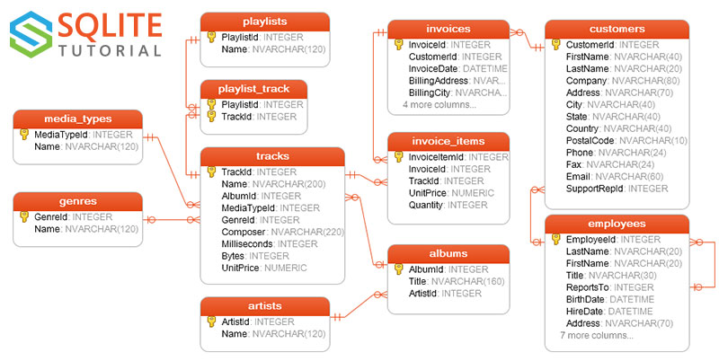

#### Install required packages


```python
! pip install ipython-sql sqlalchemy prettytable --quiet
```

#### Load Ext. sql


```python
%load_ext sql
```

#### Connect to DB


```python
%sql sqlite:///Chinook.sqlite
%config SqlMagic.displaycon = False
```

#### Chinook Schema



#### SQL Queries

#### Question 1: List all tables in the database.


```sql

%%sql
SELECT name FROM sqlite_master WHERE type='table';
```

    Done.
    


<table>
    <thead>
        <tr>
            <th>name</th>
        </tr>
    </thead>
    <tbody>
        <tr>
            <td>Album</td>
        </tr>
        <tr>
            <td>Artist</td>
        </tr>
        <tr>
            <td>Customer</td>
        </tr>
        <tr>
            <td>Employee</td>
        </tr>
        <tr>
            <td>Genre</td>
        </tr>
        <tr>
            <td>Invoice</td>
        </tr>
        <tr>
            <td>InvoiceLine</td>
        </tr>
        <tr>
            <td>MediaType</td>
        </tr>
        <tr>
            <td>Playlist</td>
        </tr>
        <tr>
            <td>PlaylistTrack</td>
        </tr>
        <tr>
            <td>Track</td>
        </tr>
    </tbody>
</table>


#### Question 2: Show first three customers from the `customers` table.


```sql

%%sql
SELECT * FROM Customer LIMIT 3;
```

    Done.
    


<table>
    <thead>
        <tr>
            <th>CustomerId</th>
            <th>FirstName</th>
            <th>LastName</th>
            <th>Company</th>
            <th>Address</th>
            <th>City</th>
            <th>State</th>
            <th>Country</th>
            <th>PostalCode</th>
            <th>Phone</th>
            <th>Fax</th>
            <th>Email</th>
            <th>SupportRepId</th>
        </tr>
    </thead>
    <tbody>
        <tr>
            <td>1</td>
            <td>Luís</td>
            <td>Gonçalves</td>
            <td>Embraer - Empresa Brasileira de Aeronáutica S.A.</td>
            <td>Av. Brigadeiro Faria Lima, 2170</td>
            <td>São José dos Campos</td>
            <td>SP</td>
            <td>Brazil</td>
            <td>12227-000</td>
            <td>+55 (12) 3923-5555</td>
            <td>+55 (12) 3923-5566</td>
            <td>luisg@embraer.com.br</td>
            <td>3</td>
        </tr>
        <tr>
            <td>2</td>
            <td>Leonie</td>
            <td>Köhler</td>
            <td>None</td>
            <td>Theodor-Heuss-Straße 34</td>
            <td>Stuttgart</td>
            <td>None</td>
            <td>Germany</td>
            <td>70174</td>
            <td>+49 0711 2842222</td>
            <td>None</td>
            <td>leonekohler@surfeu.de</td>
            <td>5</td>
        </tr>
        <tr>
            <td>3</td>
            <td>François</td>
            <td>Tremblay</td>
            <td>None</td>
            <td>1498 rue Bélanger</td>
            <td>Montréal</td>
            <td>QC</td>
            <td>Canada</td>
            <td>H2G 1A7</td>
            <td>+1 (514) 721-4711</td>
            <td>None</td>
            <td>ftremblay@gmail.com</td>
            <td>3</td>
        </tr>
    </tbody>
</table>


#### Question 3: Get the first 5 artists.


```sql
%%sql
SELECT * FROM Artist LIMIT 5;
```

    Done.
    


<table>
    <thead>
        <tr>
            <th>ArtistId</th>
            <th>Name</th>
        </tr>
    </thead>
    <tbody>
        <tr>
            <td>1</td>
            <td>AC/DC</td>
        </tr>
        <tr>
            <td>2</td>
            <td>Accept</td>
        </tr>
        <tr>
            <td>3</td>
            <td>Aerosmith</td>
        </tr>
        <tr>
            <td>4</td>
            <td>Alanis Morissette</td>
        </tr>
        <tr>
            <td>5</td>
            <td>Alice In Chains</td>
        </tr>
    </tbody>
</table>


#### Question 4: Find all customers from Brazil.


```sql
%%sql
SELECT * FROM Customer WHERE Country = 'Brazil';
```

    Done.
    


<table>
    <thead>
        <tr>
            <th>CustomerId</th>
            <th>FirstName</th>
            <th>LastName</th>
            <th>Company</th>
            <th>Address</th>
            <th>City</th>
            <th>State</th>
            <th>Country</th>
            <th>PostalCode</th>
            <th>Phone</th>
            <th>Fax</th>
            <th>Email</th>
            <th>SupportRepId</th>
        </tr>
    </thead>
    <tbody>
        <tr>
            <td>1</td>
            <td>Luís</td>
            <td>Gonçalves</td>
            <td>Embraer - Empresa Brasileira de Aeronáutica S.A.</td>
            <td>Av. Brigadeiro Faria Lima, 2170</td>
            <td>São José dos Campos</td>
            <td>SP</td>
            <td>Brazil</td>
            <td>12227-000</td>
            <td>+55 (12) 3923-5555</td>
            <td>+55 (12) 3923-5566</td>
            <td>luisg@embraer.com.br</td>
            <td>3</td>
        </tr>
        <tr>
            <td>10</td>
            <td>Eduardo</td>
            <td>Martins</td>
            <td>Woodstock Discos</td>
            <td>Rua Dr. Falcão Filho, 155</td>
            <td>São Paulo</td>
            <td>SP</td>
            <td>Brazil</td>
            <td>01007-010</td>
            <td>+55 (11) 3033-5446</td>
            <td>+55 (11) 3033-4564</td>
            <td>eduardo@woodstock.com.br</td>
            <td>4</td>
        </tr>
        <tr>
            <td>11</td>
            <td>Alexandre</td>
            <td>Rocha</td>
            <td>Banco do Brasil S.A.</td>
            <td>Av. Paulista, 2022</td>
            <td>São Paulo</td>
            <td>SP</td>
            <td>Brazil</td>
            <td>01310-200</td>
            <td>+55 (11) 3055-3278</td>
            <td>+55 (11) 3055-8131</td>
            <td>alero@uol.com.br</td>
            <td>5</td>
        </tr>
        <tr>
            <td>12</td>
            <td>Roberto</td>
            <td>Almeida</td>
            <td>Riotur</td>
            <td>Praça Pio X, 119</td>
            <td>Rio de Janeiro</td>
            <td>RJ</td>
            <td>Brazil</td>
            <td>20040-020</td>
            <td>+55 (21) 2271-7000</td>
            <td>+55 (21) 2271-7070</td>
            <td>roberto.almeida@riotur.gov.br</td>
            <td>3</td>
        </tr>
        <tr>
            <td>13</td>
            <td>Fernanda</td>
            <td>Ramos</td>
            <td>None</td>
            <td>Qe 7 Bloco G</td>
            <td>Brasília</td>
            <td>DF</td>
            <td>Brazil</td>
            <td>71020-677</td>
            <td>+55 (61) 3363-5547</td>
            <td>+55 (61) 3363-7855</td>
            <td>fernadaramos4@uol.com.br</td>
            <td>4</td>
        </tr>
    </tbody>
</table>


#### Question 5: Count how many employees are in the database.


```sql
%%sql
SELECT COUNT(*) FROM Employee;
```

    Done.
    


<table>
    <thead>
        <tr>
            <th>COUNT(*)</th>
        </tr>
    </thead>
    <tbody>
        <tr>
            <td>8</td>
        </tr>
    </tbody>
</table>


#### Question 6: List all unique genres.


```sql
%%sql
SELECT DISTINCT Name FROM Genre;
```

    Done.
    


<table>
    <thead>
        <tr>
            <th>Name</th>
        </tr>
    </thead>
    <tbody>
        <tr>
            <td>Rock</td>
        </tr>
        <tr>
            <td>Jazz</td>
        </tr>
        <tr>
            <td>Metal</td>
        </tr>
        <tr>
            <td>Alternative &amp; Punk</td>
        </tr>
        <tr>
            <td>Rock And Roll</td>
        </tr>
        <tr>
            <td>Blues</td>
        </tr>
        <tr>
            <td>Latin</td>
        </tr>
        <tr>
            <td>Reggae</td>
        </tr>
        <tr>
            <td>Pop</td>
        </tr>
        <tr>
            <td>Soundtrack</td>
        </tr>
        <tr>
            <td>Bossa Nova</td>
        </tr>
        <tr>
            <td>Easy Listening</td>
        </tr>
        <tr>
            <td>Heavy Metal</td>
        </tr>
        <tr>
            <td>R&amp;B/Soul</td>
        </tr>
        <tr>
            <td>Electronica/Dance</td>
        </tr>
        <tr>
            <td>World</td>
        </tr>
        <tr>
            <td>Hip Hop/Rap</td>
        </tr>
        <tr>
            <td>Science Fiction</td>
        </tr>
        <tr>
            <td>TV Shows</td>
        </tr>
        <tr>
            <td>Sci Fi &amp; Fantasy</td>
        </tr>
        <tr>
            <td>Drama</td>
        </tr>
        <tr>
            <td>Comedy</td>
        </tr>
        <tr>
            <td>Alternative</td>
        </tr>
        <tr>
            <td>Classical</td>
        </tr>
        <tr>
            <td>Opera</td>
        </tr>
    </tbody>
</table>


#### Question 7: Show invoices with total greater than 20.


```sql
%%sql
SELECT * FROM Invoice WHERE Total > 20;
```

    Done.
    


<table>
    <thead>
        <tr>
            <th>InvoiceId</th>
            <th>CustomerId</th>
            <th>InvoiceDate</th>
            <th>BillingAddress</th>
            <th>BillingCity</th>
            <th>BillingState</th>
            <th>BillingCountry</th>
            <th>BillingPostalCode</th>
            <th>Total</th>
        </tr>
    </thead>
    <tbody>
        <tr>
            <td>96</td>
            <td>45</td>
            <td>2010-02-18 00:00:00</td>
            <td>Erzsébet krt. 58.</td>
            <td>Budapest</td>
            <td>None</td>
            <td>Hungary</td>
            <td>H-1073</td>
            <td>21.86</td>
        </tr>
        <tr>
            <td>194</td>
            <td>46</td>
            <td>2011-04-28 00:00:00</td>
            <td>3 Chatham Street</td>
            <td>Dublin</td>
            <td>Dublin</td>
            <td>Ireland</td>
            <td>None</td>
            <td>21.86</td>
        </tr>
        <tr>
            <td>299</td>
            <td>26</td>
            <td>2012-08-05 00:00:00</td>
            <td>2211 W Berry Street</td>
            <td>Fort Worth</td>
            <td>TX</td>
            <td>USA</td>
            <td>76110</td>
            <td>23.86</td>
        </tr>
        <tr>
            <td>404</td>
            <td>6</td>
            <td>2013-11-13 00:00:00</td>
            <td>Rilská 3174/6</td>
            <td>Prague</td>
            <td>None</td>
            <td>Czech Republic</td>
            <td>14300</td>
            <td>25.86</td>
        </tr>
    </tbody>
</table>


#### Question 8: Get all media types.


```sql
%%sql
SELECT * FROM MediaType;
```

    Done.
    


<table>
    <thead>
        <tr>
            <th>MediaTypeId</th>
            <th>Name</th>
        </tr>
    </thead>
    <tbody>
        <tr>
            <td>1</td>
            <td>MPEG audio file</td>
        </tr>
        <tr>
            <td>2</td>
            <td>Protected AAC audio file</td>
        </tr>
        <tr>
            <td>3</td>
            <td>Protected MPEG-4 video file</td>
        </tr>
        <tr>
            <td>4</td>
            <td>Purchased AAC audio file</td>
        </tr>
        <tr>
            <td>5</td>
            <td>AAC audio file</td>
        </tr>
    </tbody>
</table>


#### Question 9: Show all playlists.


```sql
%%sql
SELECT * FROM Playlist;
```

    Done.
    


<table>
    <thead>
        <tr>
            <th>PlaylistId</th>
            <th>Name</th>
        </tr>
    </thead>
    <tbody>
        <tr>
            <td>1</td>
            <td>Music</td>
        </tr>
        <tr>
            <td>2</td>
            <td>Movies</td>
        </tr>
        <tr>
            <td>3</td>
            <td>TV Shows</td>
        </tr>
        <tr>
            <td>4</td>
            <td>Audiobooks</td>
        </tr>
        <tr>
            <td>5</td>
            <td>90’s Music</td>
        </tr>
        <tr>
            <td>6</td>
            <td>Audiobooks</td>
        </tr>
        <tr>
            <td>7</td>
            <td>Movies</td>
        </tr>
        <tr>
            <td>8</td>
            <td>Music</td>
        </tr>
        <tr>
            <td>9</td>
            <td>Music Videos</td>
        </tr>
        <tr>
            <td>10</td>
            <td>TV Shows</td>
        </tr>
        <tr>
            <td>11</td>
            <td>Brazilian Music</td>
        </tr>
        <tr>
            <td>12</td>
            <td>Classical</td>
        </tr>
        <tr>
            <td>13</td>
            <td>Classical 101 - Deep Cuts</td>
        </tr>
        <tr>
            <td>14</td>
            <td>Classical 101 - Next Steps</td>
        </tr>
        <tr>
            <td>15</td>
            <td>Classical 101 - The Basics</td>
        </tr>
        <tr>
            <td>16</td>
            <td>Grunge</td>
        </tr>
        <tr>
            <td>17</td>
            <td>Heavy Metal Classic</td>
        </tr>
        <tr>
            <td>18</td>
            <td>On-The-Go 1</td>
        </tr>
    </tbody>
</table>


#### Question 10: Find the number of tracks in the database.


```sql
%%sql
SELECT COUNT(*) AS TrackCount FROM Track;
```

    Done.
    


<table>
    <thead>
        <tr>
            <th>TrackCount</th>
        </tr>
    </thead>
    <tbody>
        <tr>
            <td>3503</td>
        </tr>
    </tbody>
</table>


#### Question 11: Find all invoices from 2009.


```sql
%%sql
SELECT * FROM Invoice WHERE InvoiceDate LIKE '2009%';
```

    Done.
    


<table>
    <thead>
        <tr>
            <th>InvoiceId</th>
            <th>CustomerId</th>
            <th>InvoiceDate</th>
            <th>BillingAddress</th>
            <th>BillingCity</th>
            <th>BillingState</th>
            <th>BillingCountry</th>
            <th>BillingPostalCode</th>
            <th>Total</th>
        </tr>
    </thead>
    <tbody>
        <tr>
            <td>1</td>
            <td>2</td>
            <td>2009-01-01 00:00:00</td>
            <td>Theodor-Heuss-Straße 34</td>
            <td>Stuttgart</td>
            <td>None</td>
            <td>Germany</td>
            <td>70174</td>
            <td>1.98</td>
        </tr>
        <tr>
            <td>2</td>
            <td>4</td>
            <td>2009-01-02 00:00:00</td>
            <td>Ullevålsveien 14</td>
            <td>Oslo</td>
            <td>None</td>
            <td>Norway</td>
            <td>0171</td>
            <td>3.96</td>
        </tr>
        <tr>
            <td>3</td>
            <td>8</td>
            <td>2009-01-03 00:00:00</td>
            <td>Grétrystraat 63</td>
            <td>Brussels</td>
            <td>None</td>
            <td>Belgium</td>
            <td>1000</td>
            <td>5.94</td>
        </tr>
        <tr>
            <td>4</td>
            <td>14</td>
            <td>2009-01-06 00:00:00</td>
            <td>8210 111 ST NW</td>
            <td>Edmonton</td>
            <td>AB</td>
            <td>Canada</td>
            <td>T6G 2C7</td>
            <td>8.91</td>
        </tr>
        <tr>
            <td>5</td>
            <td>23</td>
            <td>2009-01-11 00:00:00</td>
            <td>69 Salem Street</td>
            <td>Boston</td>
            <td>MA</td>
            <td>USA</td>
            <td>2113</td>
            <td>13.86</td>
        </tr>
        <tr>
            <td>6</td>
            <td>37</td>
            <td>2009-01-19 00:00:00</td>
            <td>Berger Straße 10</td>
            <td>Frankfurt</td>
            <td>None</td>
            <td>Germany</td>
            <td>60316</td>
            <td>0.99</td>
        </tr>
        <tr>
            <td>7</td>
            <td>38</td>
            <td>2009-02-01 00:00:00</td>
            <td>Barbarossastraße 19</td>
            <td>Berlin</td>
            <td>None</td>
            <td>Germany</td>
            <td>10779</td>
            <td>1.98</td>
        </tr>
        <tr>
            <td>8</td>
            <td>40</td>
            <td>2009-02-01 00:00:00</td>
            <td>8, Rue Hanovre</td>
            <td>Paris</td>
            <td>None</td>
            <td>France</td>
            <td>75002</td>
            <td>1.98</td>
        </tr>
        <tr>
            <td>9</td>
            <td>42</td>
            <td>2009-02-02 00:00:00</td>
            <td>9, Place Louis Barthou</td>
            <td>Bordeaux</td>
            <td>None</td>
            <td>France</td>
            <td>33000</td>
            <td>3.96</td>
        </tr>
        <tr>
            <td>10</td>
            <td>46</td>
            <td>2009-02-03 00:00:00</td>
            <td>3 Chatham Street</td>
            <td>Dublin</td>
            <td>Dublin</td>
            <td>Ireland</td>
            <td>None</td>
            <td>5.94</td>
        </tr>
        <tr>
            <td>11</td>
            <td>52</td>
            <td>2009-02-06 00:00:00</td>
            <td>202 Hoxton Street</td>
            <td>London</td>
            <td>None</td>
            <td>United Kingdom</td>
            <td>N1 5LH</td>
            <td>8.91</td>
        </tr>
        <tr>
            <td>12</td>
            <td>2</td>
            <td>2009-02-11 00:00:00</td>
            <td>Theodor-Heuss-Straße 34</td>
            <td>Stuttgart</td>
            <td>None</td>
            <td>Germany</td>
            <td>70174</td>
            <td>13.86</td>
        </tr>
        <tr>
            <td>13</td>
            <td>16</td>
            <td>2009-02-19 00:00:00</td>
            <td>1600 Amphitheatre Parkway</td>
            <td>Mountain View</td>
            <td>CA</td>
            <td>USA</td>
            <td>94043-1351</td>
            <td>0.99</td>
        </tr>
        <tr>
            <td>14</td>
            <td>17</td>
            <td>2009-03-04 00:00:00</td>
            <td>1 Microsoft Way</td>
            <td>Redmond</td>
            <td>WA</td>
            <td>USA</td>
            <td>98052-8300</td>
            <td>1.98</td>
        </tr>
        <tr>
            <td>15</td>
            <td>19</td>
            <td>2009-03-04 00:00:00</td>
            <td>1 Infinite Loop</td>
            <td>Cupertino</td>
            <td>CA</td>
            <td>USA</td>
            <td>95014</td>
            <td>1.98</td>
        </tr>
        <tr>
            <td>16</td>
            <td>21</td>
            <td>2009-03-05 00:00:00</td>
            <td>801 W 4th Street</td>
            <td>Reno</td>
            <td>NV</td>
            <td>USA</td>
            <td>89503</td>
            <td>3.96</td>
        </tr>
        <tr>
            <td>17</td>
            <td>25</td>
            <td>2009-03-06 00:00:00</td>
            <td>319 N. Frances Street</td>
            <td>Madison</td>
            <td>WI</td>
            <td>USA</td>
            <td>53703</td>
            <td>5.94</td>
        </tr>
        <tr>
            <td>18</td>
            <td>31</td>
            <td>2009-03-09 00:00:00</td>
            <td>194A Chain Lake Drive</td>
            <td>Halifax</td>
            <td>NS</td>
            <td>Canada</td>
            <td>B3S 1C5</td>
            <td>8.91</td>
        </tr>
        <tr>
            <td>19</td>
            <td>40</td>
            <td>2009-03-14 00:00:00</td>
            <td>8, Rue Hanovre</td>
            <td>Paris</td>
            <td>None</td>
            <td>France</td>
            <td>75002</td>
            <td>13.86</td>
        </tr>
        <tr>
            <td>20</td>
            <td>54</td>
            <td>2009-03-22 00:00:00</td>
            <td>110 Raeburn Pl</td>
            <td>Edinburgh </td>
            <td>None</td>
            <td>United Kingdom</td>
            <td>EH4 1HH</td>
            <td>0.99</td>
        </tr>
        <tr>
            <td>21</td>
            <td>55</td>
            <td>2009-04-04 00:00:00</td>
            <td>421 Bourke Street</td>
            <td>Sidney</td>
            <td>NSW</td>
            <td>Australia</td>
            <td>2010</td>
            <td>1.98</td>
        </tr>
        <tr>
            <td>22</td>
            <td>57</td>
            <td>2009-04-04 00:00:00</td>
            <td>Calle Lira, 198</td>
            <td>Santiago</td>
            <td>None</td>
            <td>Chile</td>
            <td>None</td>
            <td>1.98</td>
        </tr>
        <tr>
            <td>23</td>
            <td>59</td>
            <td>2009-04-05 00:00:00</td>
            <td>3,Raj Bhavan Road</td>
            <td>Bangalore</td>
            <td>None</td>
            <td>India</td>
            <td>560001</td>
            <td>3.96</td>
        </tr>
        <tr>
            <td>24</td>
            <td>4</td>
            <td>2009-04-06 00:00:00</td>
            <td>Ullevålsveien 14</td>
            <td>Oslo</td>
            <td>None</td>
            <td>Norway</td>
            <td>0171</td>
            <td>5.94</td>
        </tr>
        <tr>
            <td>25</td>
            <td>10</td>
            <td>2009-04-09 00:00:00</td>
            <td>Rua Dr. Falcão Filho, 155</td>
            <td>São Paulo</td>
            <td>SP</td>
            <td>Brazil</td>
            <td>01007-010</td>
            <td>8.91</td>
        </tr>
        <tr>
            <td>26</td>
            <td>19</td>
            <td>2009-04-14 00:00:00</td>
            <td>1 Infinite Loop</td>
            <td>Cupertino</td>
            <td>CA</td>
            <td>USA</td>
            <td>95014</td>
            <td>13.86</td>
        </tr>
        <tr>
            <td>27</td>
            <td>33</td>
            <td>2009-04-22 00:00:00</td>
            <td>5112 48 Street</td>
            <td>Yellowknife</td>
            <td>NT</td>
            <td>Canada</td>
            <td>X1A 1N6</td>
            <td>0.99</td>
        </tr>
        <tr>
            <td>28</td>
            <td>34</td>
            <td>2009-05-05 00:00:00</td>
            <td>Rua da Assunção 53</td>
            <td>Lisbon</td>
            <td>None</td>
            <td>Portugal</td>
            <td>None</td>
            <td>1.98</td>
        </tr>
        <tr>
            <td>29</td>
            <td>36</td>
            <td>2009-05-05 00:00:00</td>
            <td>Tauentzienstraße 8</td>
            <td>Berlin</td>
            <td>None</td>
            <td>Germany</td>
            <td>10789</td>
            <td>1.98</td>
        </tr>
        <tr>
            <td>30</td>
            <td>38</td>
            <td>2009-05-06 00:00:00</td>
            <td>Barbarossastraße 19</td>
            <td>Berlin</td>
            <td>None</td>
            <td>Germany</td>
            <td>10779</td>
            <td>3.96</td>
        </tr>
        <tr>
            <td>31</td>
            <td>42</td>
            <td>2009-05-07 00:00:00</td>
            <td>9, Place Louis Barthou</td>
            <td>Bordeaux</td>
            <td>None</td>
            <td>France</td>
            <td>33000</td>
            <td>5.94</td>
        </tr>
        <tr>
            <td>32</td>
            <td>48</td>
            <td>2009-05-10 00:00:00</td>
            <td>Lijnbaansgracht 120bg</td>
            <td>Amsterdam</td>
            <td>VV</td>
            <td>Netherlands</td>
            <td>1016</td>
            <td>8.91</td>
        </tr>
        <tr>
            <td>33</td>
            <td>57</td>
            <td>2009-05-15 00:00:00</td>
            <td>Calle Lira, 198</td>
            <td>Santiago</td>
            <td>None</td>
            <td>Chile</td>
            <td>None</td>
            <td>13.86</td>
        </tr>
        <tr>
            <td>34</td>
            <td>12</td>
            <td>2009-05-23 00:00:00</td>
            <td>Praça Pio X, 119</td>
            <td>Rio de Janeiro</td>
            <td>RJ</td>
            <td>Brazil</td>
            <td>20040-020</td>
            <td>0.99</td>
        </tr>
        <tr>
            <td>35</td>
            <td>13</td>
            <td>2009-06-05 00:00:00</td>
            <td>Qe 7 Bloco G</td>
            <td>Brasília</td>
            <td>DF</td>
            <td>Brazil</td>
            <td>71020-677</td>
            <td>1.98</td>
        </tr>
        <tr>
            <td>36</td>
            <td>15</td>
            <td>2009-06-05 00:00:00</td>
            <td>700 W Pender Street</td>
            <td>Vancouver</td>
            <td>BC</td>
            <td>Canada</td>
            <td>V6C 1G8</td>
            <td>1.98</td>
        </tr>
        <tr>
            <td>37</td>
            <td>17</td>
            <td>2009-06-06 00:00:00</td>
            <td>1 Microsoft Way</td>
            <td>Redmond</td>
            <td>WA</td>
            <td>USA</td>
            <td>98052-8300</td>
            <td>3.96</td>
        </tr>
        <tr>
            <td>38</td>
            <td>21</td>
            <td>2009-06-07 00:00:00</td>
            <td>801 W 4th Street</td>
            <td>Reno</td>
            <td>NV</td>
            <td>USA</td>
            <td>89503</td>
            <td>5.94</td>
        </tr>
        <tr>
            <td>39</td>
            <td>27</td>
            <td>2009-06-10 00:00:00</td>
            <td>1033 N Park Ave</td>
            <td>Tucson</td>
            <td>AZ</td>
            <td>USA</td>
            <td>85719</td>
            <td>8.91</td>
        </tr>
        <tr>
            <td>40</td>
            <td>36</td>
            <td>2009-06-15 00:00:00</td>
            <td>Tauentzienstraße 8</td>
            <td>Berlin</td>
            <td>None</td>
            <td>Germany</td>
            <td>10789</td>
            <td>13.86</td>
        </tr>
        <tr>
            <td>41</td>
            <td>50</td>
            <td>2009-06-23 00:00:00</td>
            <td>C/ San Bernardo 85</td>
            <td>Madrid</td>
            <td>None</td>
            <td>Spain</td>
            <td>28015</td>
            <td>0.99</td>
        </tr>
        <tr>
            <td>42</td>
            <td>51</td>
            <td>2009-07-06 00:00:00</td>
            <td>Celsiusg. 9</td>
            <td>Stockholm</td>
            <td>None</td>
            <td>Sweden</td>
            <td>11230</td>
            <td>1.98</td>
        </tr>
        <tr>
            <td>43</td>
            <td>53</td>
            <td>2009-07-06 00:00:00</td>
            <td>113 Lupus St</td>
            <td>London</td>
            <td>None</td>
            <td>United Kingdom</td>
            <td>SW1V 3EN</td>
            <td>1.98</td>
        </tr>
        <tr>
            <td>44</td>
            <td>55</td>
            <td>2009-07-07 00:00:00</td>
            <td>421 Bourke Street</td>
            <td>Sidney</td>
            <td>NSW</td>
            <td>Australia</td>
            <td>2010</td>
            <td>3.96</td>
        </tr>
        <tr>
            <td>45</td>
            <td>59</td>
            <td>2009-07-08 00:00:00</td>
            <td>3,Raj Bhavan Road</td>
            <td>Bangalore</td>
            <td>None</td>
            <td>India</td>
            <td>560001</td>
            <td>5.94</td>
        </tr>
        <tr>
            <td>46</td>
            <td>6</td>
            <td>2009-07-11 00:00:00</td>
            <td>Rilská 3174/6</td>
            <td>Prague</td>
            <td>None</td>
            <td>Czech Republic</td>
            <td>14300</td>
            <td>8.91</td>
        </tr>
        <tr>
            <td>47</td>
            <td>15</td>
            <td>2009-07-16 00:00:00</td>
            <td>700 W Pender Street</td>
            <td>Vancouver</td>
            <td>BC</td>
            <td>Canada</td>
            <td>V6C 1G8</td>
            <td>13.86</td>
        </tr>
        <tr>
            <td>48</td>
            <td>29</td>
            <td>2009-07-24 00:00:00</td>
            <td>796 Dundas Street West</td>
            <td>Toronto</td>
            <td>ON</td>
            <td>Canada</td>
            <td>M6J 1V1</td>
            <td>0.99</td>
        </tr>
        <tr>
            <td>49</td>
            <td>30</td>
            <td>2009-08-06 00:00:00</td>
            <td>230 Elgin Street</td>
            <td>Ottawa</td>
            <td>ON</td>
            <td>Canada</td>
            <td>K2P 1L7</td>
            <td>1.98</td>
        </tr>
        <tr>
            <td>50</td>
            <td>32</td>
            <td>2009-08-06 00:00:00</td>
            <td>696 Osborne Street</td>
            <td>Winnipeg</td>
            <td>MB</td>
            <td>Canada</td>
            <td>R3L 2B9</td>
            <td>1.98</td>
        </tr>
        <tr>
            <td>51</td>
            <td>34</td>
            <td>2009-08-07 00:00:00</td>
            <td>Rua da Assunção 53</td>
            <td>Lisbon</td>
            <td>None</td>
            <td>Portugal</td>
            <td>None</td>
            <td>3.96</td>
        </tr>
        <tr>
            <td>52</td>
            <td>38</td>
            <td>2009-08-08 00:00:00</td>
            <td>Barbarossastraße 19</td>
            <td>Berlin</td>
            <td>None</td>
            <td>Germany</td>
            <td>10779</td>
            <td>5.94</td>
        </tr>
        <tr>
            <td>53</td>
            <td>44</td>
            <td>2009-08-11 00:00:00</td>
            <td>Porthaninkatu 9</td>
            <td>Helsinki</td>
            <td>None</td>
            <td>Finland</td>
            <td>00530</td>
            <td>8.91</td>
        </tr>
        <tr>
            <td>54</td>
            <td>53</td>
            <td>2009-08-16 00:00:00</td>
            <td>113 Lupus St</td>
            <td>London</td>
            <td>None</td>
            <td>United Kingdom</td>
            <td>SW1V 3EN</td>
            <td>13.86</td>
        </tr>
        <tr>
            <td>55</td>
            <td>8</td>
            <td>2009-08-24 00:00:00</td>
            <td>Grétrystraat 63</td>
            <td>Brussels</td>
            <td>None</td>
            <td>Belgium</td>
            <td>1000</td>
            <td>0.99</td>
        </tr>
        <tr>
            <td>56</td>
            <td>9</td>
            <td>2009-09-06 00:00:00</td>
            <td>Sønder Boulevard 51</td>
            <td>Copenhagen</td>
            <td>None</td>
            <td>Denmark</td>
            <td>1720</td>
            <td>1.98</td>
        </tr>
        <tr>
            <td>57</td>
            <td>11</td>
            <td>2009-09-06 00:00:00</td>
            <td>Av. Paulista, 2022</td>
            <td>São Paulo</td>
            <td>SP</td>
            <td>Brazil</td>
            <td>01310-200</td>
            <td>1.98</td>
        </tr>
        <tr>
            <td>58</td>
            <td>13</td>
            <td>2009-09-07 00:00:00</td>
            <td>Qe 7 Bloco G</td>
            <td>Brasília</td>
            <td>DF</td>
            <td>Brazil</td>
            <td>71020-677</td>
            <td>3.96</td>
        </tr>
        <tr>
            <td>59</td>
            <td>17</td>
            <td>2009-09-08 00:00:00</td>
            <td>1 Microsoft Way</td>
            <td>Redmond</td>
            <td>WA</td>
            <td>USA</td>
            <td>98052-8300</td>
            <td>5.94</td>
        </tr>
        <tr>
            <td>60</td>
            <td>23</td>
            <td>2009-09-11 00:00:00</td>
            <td>69 Salem Street</td>
            <td>Boston</td>
            <td>MA</td>
            <td>USA</td>
            <td>2113</td>
            <td>8.91</td>
        </tr>
        <tr>
            <td>61</td>
            <td>32</td>
            <td>2009-09-16 00:00:00</td>
            <td>696 Osborne Street</td>
            <td>Winnipeg</td>
            <td>MB</td>
            <td>Canada</td>
            <td>R3L 2B9</td>
            <td>13.86</td>
        </tr>
        <tr>
            <td>62</td>
            <td>46</td>
            <td>2009-09-24 00:00:00</td>
            <td>3 Chatham Street</td>
            <td>Dublin</td>
            <td>Dublin</td>
            <td>Ireland</td>
            <td>None</td>
            <td>0.99</td>
        </tr>
        <tr>
            <td>63</td>
            <td>47</td>
            <td>2009-10-07 00:00:00</td>
            <td>Via Degli Scipioni, 43</td>
            <td>Rome</td>
            <td>RM</td>
            <td>Italy</td>
            <td>00192</td>
            <td>1.98</td>
        </tr>
        <tr>
            <td>64</td>
            <td>49</td>
            <td>2009-10-07 00:00:00</td>
            <td>Ordynacka 10</td>
            <td>Warsaw</td>
            <td>None</td>
            <td>Poland</td>
            <td>00-358</td>
            <td>1.98</td>
        </tr>
        <tr>
            <td>65</td>
            <td>51</td>
            <td>2009-10-08 00:00:00</td>
            <td>Celsiusg. 9</td>
            <td>Stockholm</td>
            <td>None</td>
            <td>Sweden</td>
            <td>11230</td>
            <td>3.96</td>
        </tr>
        <tr>
            <td>66</td>
            <td>55</td>
            <td>2009-10-09 00:00:00</td>
            <td>421 Bourke Street</td>
            <td>Sidney</td>
            <td>NSW</td>
            <td>Australia</td>
            <td>2010</td>
            <td>5.94</td>
        </tr>
        <tr>
            <td>67</td>
            <td>2</td>
            <td>2009-10-12 00:00:00</td>
            <td>Theodor-Heuss-Straße 34</td>
            <td>Stuttgart</td>
            <td>None</td>
            <td>Germany</td>
            <td>70174</td>
            <td>8.91</td>
        </tr>
        <tr>
            <td>68</td>
            <td>11</td>
            <td>2009-10-17 00:00:00</td>
            <td>Av. Paulista, 2022</td>
            <td>São Paulo</td>
            <td>SP</td>
            <td>Brazil</td>
            <td>01310-200</td>
            <td>13.86</td>
        </tr>
        <tr>
            <td>69</td>
            <td>25</td>
            <td>2009-10-25 00:00:00</td>
            <td>319 N. Frances Street</td>
            <td>Madison</td>
            <td>WI</td>
            <td>USA</td>
            <td>53703</td>
            <td>0.99</td>
        </tr>
        <tr>
            <td>70</td>
            <td>26</td>
            <td>2009-11-07 00:00:00</td>
            <td>2211 W Berry Street</td>
            <td>Fort Worth</td>
            <td>TX</td>
            <td>USA</td>
            <td>76110</td>
            <td>1.98</td>
        </tr>
        <tr>
            <td>71</td>
            <td>28</td>
            <td>2009-11-07 00:00:00</td>
            <td>302 S 700 E</td>
            <td>Salt Lake City</td>
            <td>UT</td>
            <td>USA</td>
            <td>84102</td>
            <td>1.98</td>
        </tr>
        <tr>
            <td>72</td>
            <td>30</td>
            <td>2009-11-08 00:00:00</td>
            <td>230 Elgin Street</td>
            <td>Ottawa</td>
            <td>ON</td>
            <td>Canada</td>
            <td>K2P 1L7</td>
            <td>3.96</td>
        </tr>
        <tr>
            <td>73</td>
            <td>34</td>
            <td>2009-11-09 00:00:00</td>
            <td>Rua da Assunção 53</td>
            <td>Lisbon</td>
            <td>None</td>
            <td>Portugal</td>
            <td>None</td>
            <td>5.94</td>
        </tr>
        <tr>
            <td>74</td>
            <td>40</td>
            <td>2009-11-12 00:00:00</td>
            <td>8, Rue Hanovre</td>
            <td>Paris</td>
            <td>None</td>
            <td>France</td>
            <td>75002</td>
            <td>8.91</td>
        </tr>
        <tr>
            <td>75</td>
            <td>49</td>
            <td>2009-11-17 00:00:00</td>
            <td>Ordynacka 10</td>
            <td>Warsaw</td>
            <td>None</td>
            <td>Poland</td>
            <td>00-358</td>
            <td>13.86</td>
        </tr>
        <tr>
            <td>76</td>
            <td>4</td>
            <td>2009-11-25 00:00:00</td>
            <td>Ullevålsveien 14</td>
            <td>Oslo</td>
            <td>None</td>
            <td>Norway</td>
            <td>0171</td>
            <td>0.99</td>
        </tr>
        <tr>
            <td>77</td>
            <td>5</td>
            <td>2009-12-08 00:00:00</td>
            <td>Klanova 9/506</td>
            <td>Prague</td>
            <td>None</td>
            <td>Czech Republic</td>
            <td>14700</td>
            <td>1.98</td>
        </tr>
        <tr>
            <td>78</td>
            <td>7</td>
            <td>2009-12-08 00:00:00</td>
            <td>Rotenturmstraße 4, 1010 Innere Stadt</td>
            <td>Vienne</td>
            <td>None</td>
            <td>Austria</td>
            <td>1010</td>
            <td>1.98</td>
        </tr>
        <tr>
            <td>79</td>
            <td>9</td>
            <td>2009-12-09 00:00:00</td>
            <td>Sønder Boulevard 51</td>
            <td>Copenhagen</td>
            <td>None</td>
            <td>Denmark</td>
            <td>1720</td>
            <td>3.96</td>
        </tr>
        <tr>
            <td>80</td>
            <td>13</td>
            <td>2009-12-10 00:00:00</td>
            <td>Qe 7 Bloco G</td>
            <td>Brasília</td>
            <td>DF</td>
            <td>Brazil</td>
            <td>71020-677</td>
            <td>5.94</td>
        </tr>
        <tr>
            <td>81</td>
            <td>19</td>
            <td>2009-12-13 00:00:00</td>
            <td>1 Infinite Loop</td>
            <td>Cupertino</td>
            <td>CA</td>
            <td>USA</td>
            <td>95014</td>
            <td>8.91</td>
        </tr>
        <tr>
            <td>82</td>
            <td>28</td>
            <td>2009-12-18 00:00:00</td>
            <td>302 S 700 E</td>
            <td>Salt Lake City</td>
            <td>UT</td>
            <td>USA</td>
            <td>84102</td>
            <td>13.86</td>
        </tr>
        <tr>
            <td>83</td>
            <td>42</td>
            <td>2009-12-26 00:00:00</td>
            <td>9, Place Louis Barthou</td>
            <td>Bordeaux</td>
            <td>None</td>
            <td>France</td>
            <td>33000</td>
            <td>0.99</td>
        </tr>
    </tbody>
</table>


#### Question 12: Show all tracks that belong to album 'Let There Be Rock'.


```sql
%%sql
SELECT t.Name FROM Track t
JOIN Album a ON t.AlbumId = a.AlbumId
WHERE a.Title = 'Let There Be Rock';
```

    Done.
    


<table>
    <thead>
        <tr>
            <th>Name</th>
        </tr>
    </thead>
    <tbody>
        <tr>
            <td>Go Down</td>
        </tr>
        <tr>
            <td>Dog Eat Dog</td>
        </tr>
        <tr>
            <td>Let There Be Rock</td>
        </tr>
        <tr>
            <td>Bad Boy Boogie</td>
        </tr>
        <tr>
            <td>Problem Child</td>
        </tr>
        <tr>
            <td>Overdose</td>
        </tr>
        <tr>
            <td>Hell Ain&#x27;t A Bad Place To Be</td>
        </tr>
        <tr>
            <td>Whole Lotta Rosie</td>
        </tr>
    </tbody>
</table>


#### Question 13: Find the total number of tracks per genre.


```sql
%%sql
SELECT g.Name AS Genre, COUNT(*) AS TrackCount
FROM Track t
JOIN Genre g ON t.GenreId = g.GenreId
GROUP BY g.Name;
```

    Done.
    


<table>
    <thead>
        <tr>
            <th>Genre</th>
            <th>TrackCount</th>
        </tr>
    </thead>
    <tbody>
        <tr>
            <td>Alternative</td>
            <td>40</td>
        </tr>
        <tr>
            <td>Alternative &amp; Punk</td>
            <td>332</td>
        </tr>
        <tr>
            <td>Blues</td>
            <td>81</td>
        </tr>
        <tr>
            <td>Bossa Nova</td>
            <td>15</td>
        </tr>
        <tr>
            <td>Classical</td>
            <td>74</td>
        </tr>
        <tr>
            <td>Comedy</td>
            <td>17</td>
        </tr>
        <tr>
            <td>Drama</td>
            <td>64</td>
        </tr>
        <tr>
            <td>Easy Listening</td>
            <td>24</td>
        </tr>
        <tr>
            <td>Electronica/Dance</td>
            <td>30</td>
        </tr>
        <tr>
            <td>Heavy Metal</td>
            <td>28</td>
        </tr>
        <tr>
            <td>Hip Hop/Rap</td>
            <td>35</td>
        </tr>
        <tr>
            <td>Jazz</td>
            <td>130</td>
        </tr>
        <tr>
            <td>Latin</td>
            <td>579</td>
        </tr>
        <tr>
            <td>Metal</td>
            <td>374</td>
        </tr>
        <tr>
            <td>Opera</td>
            <td>1</td>
        </tr>
        <tr>
            <td>Pop</td>
            <td>48</td>
        </tr>
        <tr>
            <td>R&amp;B/Soul</td>
            <td>61</td>
        </tr>
        <tr>
            <td>Reggae</td>
            <td>58</td>
        </tr>
        <tr>
            <td>Rock</td>
            <td>1297</td>
        </tr>
        <tr>
            <td>Rock And Roll</td>
            <td>12</td>
        </tr>
        <tr>
            <td>Sci Fi &amp; Fantasy</td>
            <td>26</td>
        </tr>
        <tr>
            <td>Science Fiction</td>
            <td>13</td>
        </tr>
        <tr>
            <td>Soundtrack</td>
            <td>43</td>
        </tr>
        <tr>
            <td>TV Shows</td>
            <td>93</td>
        </tr>
        <tr>
            <td>World</td>
            <td>28</td>
        </tr>
    </tbody>
</table>


#### Question 14: Get the most expensive track.


```sql
%%sql
SELECT Name, UnitPrice FROM Track ORDER BY UnitPrice DESC LIMIT 1;
```

    Done.
    


<table>
    <thead>
        <tr>
            <th>Name</th>
            <th>UnitPrice</th>
        </tr>
    </thead>
    <tbody>
        <tr>
            <td>Battlestar Galactica: The Story So Far</td>
            <td>1.99</td>
        </tr>
    </tbody>
</table>


#### Question 15: Find customers who have spent more than 50 in total.


```sql
%%sql
SELECT CustomerId, SUM(Total) AS TotalSpent
FROM Invoice
GROUP BY CustomerId
HAVING TotalSpent > 50;
```

    Done.
    


<table>
    <thead>
        <tr>
            <th>CustomerId</th>
            <th>TotalSpent</th>
        </tr>
    </thead>
    <tbody>
    </tbody>
</table>


#### Question 16: Show all employees who report to someone.


```sql
%%sql
SELECT * FROM Employee WHERE ReportsTo IS NOT NULL;
```

    Done.
    


<table>
    <thead>
        <tr>
            <th>EmployeeId</th>
            <th>LastName</th>
            <th>FirstName</th>
            <th>Title</th>
            <th>ReportsTo</th>
            <th>BirthDate</th>
            <th>HireDate</th>
            <th>Address</th>
            <th>City</th>
            <th>State</th>
            <th>Country</th>
            <th>PostalCode</th>
            <th>Phone</th>
            <th>Fax</th>
            <th>Email</th>
        </tr>
    </thead>
    <tbody>
        <tr>
            <td>2</td>
            <td>Edwards</td>
            <td>Nancy</td>
            <td>Sales Manager</td>
            <td>1</td>
            <td>1958-12-08 00:00:00</td>
            <td>2002-05-01 00:00:00</td>
            <td>825 8 Ave SW</td>
            <td>Calgary</td>
            <td>AB</td>
            <td>Canada</td>
            <td>T2P 2T3</td>
            <td>+1 (403) 262-3443</td>
            <td>+1 (403) 262-3322</td>
            <td>nancy@chinookcorp.com</td>
        </tr>
        <tr>
            <td>3</td>
            <td>Peacock</td>
            <td>Jane</td>
            <td>Sales Support Agent</td>
            <td>2</td>
            <td>1973-08-29 00:00:00</td>
            <td>2002-04-01 00:00:00</td>
            <td>1111 6 Ave SW</td>
            <td>Calgary</td>
            <td>AB</td>
            <td>Canada</td>
            <td>T2P 5M5</td>
            <td>+1 (403) 262-3443</td>
            <td>+1 (403) 262-6712</td>
            <td>jane@chinookcorp.com</td>
        </tr>
        <tr>
            <td>4</td>
            <td>Park</td>
            <td>Margaret</td>
            <td>Sales Support Agent</td>
            <td>2</td>
            <td>1947-09-19 00:00:00</td>
            <td>2003-05-03 00:00:00</td>
            <td>683 10 Street SW</td>
            <td>Calgary</td>
            <td>AB</td>
            <td>Canada</td>
            <td>T2P 5G3</td>
            <td>+1 (403) 263-4423</td>
            <td>+1 (403) 263-4289</td>
            <td>margaret@chinookcorp.com</td>
        </tr>
        <tr>
            <td>5</td>
            <td>Johnson</td>
            <td>Steve</td>
            <td>Sales Support Agent</td>
            <td>2</td>
            <td>1965-03-03 00:00:00</td>
            <td>2003-10-17 00:00:00</td>
            <td>7727B 41 Ave</td>
            <td>Calgary</td>
            <td>AB</td>
            <td>Canada</td>
            <td>T3B 1Y7</td>
            <td>1 (780) 836-9987</td>
            <td>1 (780) 836-9543</td>
            <td>steve@chinookcorp.com</td>
        </tr>
        <tr>
            <td>6</td>
            <td>Mitchell</td>
            <td>Michael</td>
            <td>IT Manager</td>
            <td>1</td>
            <td>1973-07-01 00:00:00</td>
            <td>2003-10-17 00:00:00</td>
            <td>5827 Bowness Road NW</td>
            <td>Calgary</td>
            <td>AB</td>
            <td>Canada</td>
            <td>T3B 0C5</td>
            <td>+1 (403) 246-9887</td>
            <td>+1 (403) 246-9899</td>
            <td>michael@chinookcorp.com</td>
        </tr>
        <tr>
            <td>7</td>
            <td>King</td>
            <td>Robert</td>
            <td>IT Staff</td>
            <td>6</td>
            <td>1970-05-29 00:00:00</td>
            <td>2004-01-02 00:00:00</td>
            <td>590 Columbia Boulevard West</td>
            <td>Lethbridge</td>
            <td>AB</td>
            <td>Canada</td>
            <td>T1K 5N8</td>
            <td>+1 (403) 456-9986</td>
            <td>+1 (403) 456-8485</td>
            <td>robert@chinookcorp.com</td>
        </tr>
        <tr>
            <td>8</td>
            <td>Callahan</td>
            <td>Laura</td>
            <td>IT Staff</td>
            <td>6</td>
            <td>1968-01-09 00:00:00</td>
            <td>2004-03-04 00:00:00</td>
            <td>923 7 ST NW</td>
            <td>Lethbridge</td>
            <td>AB</td>
            <td>Canada</td>
            <td>T1H 1Y8</td>
            <td>+1 (403) 467-3351</td>
            <td>+1 (403) 467-8772</td>
            <td>laura@chinookcorp.com</td>
        </tr>
    </tbody>
</table>


#### Question 17: Find the number of invoices per country.


```sql
%%sql
SELECT BillingCountry, COUNT(*) AS InvoiceCount
FROM Invoice
GROUP BY BillingCountry;
```

    Done.
    


<table>
    <thead>
        <tr>
            <th>BillingCountry</th>
            <th>InvoiceCount</th>
        </tr>
    </thead>
    <tbody>
        <tr>
            <td>Argentina</td>
            <td>7</td>
        </tr>
        <tr>
            <td>Australia</td>
            <td>7</td>
        </tr>
        <tr>
            <td>Austria</td>
            <td>7</td>
        </tr>
        <tr>
            <td>Belgium</td>
            <td>7</td>
        </tr>
        <tr>
            <td>Brazil</td>
            <td>35</td>
        </tr>
        <tr>
            <td>Canada</td>
            <td>56</td>
        </tr>
        <tr>
            <td>Chile</td>
            <td>7</td>
        </tr>
        <tr>
            <td>Czech Republic</td>
            <td>14</td>
        </tr>
        <tr>
            <td>Denmark</td>
            <td>7</td>
        </tr>
        <tr>
            <td>Finland</td>
            <td>7</td>
        </tr>
        <tr>
            <td>France</td>
            <td>35</td>
        </tr>
        <tr>
            <td>Germany</td>
            <td>28</td>
        </tr>
        <tr>
            <td>Hungary</td>
            <td>7</td>
        </tr>
        <tr>
            <td>India</td>
            <td>13</td>
        </tr>
        <tr>
            <td>Ireland</td>
            <td>7</td>
        </tr>
        <tr>
            <td>Italy</td>
            <td>7</td>
        </tr>
        <tr>
            <td>Netherlands</td>
            <td>7</td>
        </tr>
        <tr>
            <td>Norway</td>
            <td>7</td>
        </tr>
        <tr>
            <td>Poland</td>
            <td>7</td>
        </tr>
        <tr>
            <td>Portugal</td>
            <td>14</td>
        </tr>
        <tr>
            <td>Spain</td>
            <td>7</td>
        </tr>
        <tr>
            <td>Sweden</td>
            <td>7</td>
        </tr>
        <tr>
            <td>USA</td>
            <td>91</td>
        </tr>
        <tr>
            <td>United Kingdom</td>
            <td>21</td>
        </tr>
    </tbody>
</table>


#### Question 18: Get the average invoice total per country.


```sql
%%sql
SELECT BillingCountry, AVG(Total) AS AvgTotal
FROM Invoice
GROUP BY BillingCountry;
```

    Done.
    


<table>
    <thead>
        <tr>
            <th>BillingCountry</th>
            <th>AvgTotal</th>
        </tr>
    </thead>
    <tbody>
        <tr>
            <td>Argentina</td>
            <td>5.374285714285714</td>
        </tr>
        <tr>
            <td>Australia</td>
            <td>5.374285714285714</td>
        </tr>
        <tr>
            <td>Austria</td>
            <td>6.088571428571428</td>
        </tr>
        <tr>
            <td>Belgium</td>
            <td>5.374285714285714</td>
        </tr>
        <tr>
            <td>Brazil</td>
            <td>5.4314285714285715</td>
        </tr>
        <tr>
            <td>Canada</td>
            <td>5.4278571428571425</td>
        </tr>
        <tr>
            <td>Chile</td>
            <td>6.659999999999999</td>
        </tr>
        <tr>
            <td>Czech Republic</td>
            <td>6.445714285714286</td>
        </tr>
        <tr>
            <td>Denmark</td>
            <td>5.374285714285714</td>
        </tr>
        <tr>
            <td>Finland</td>
            <td>5.945714285714286</td>
        </tr>
        <tr>
            <td>France</td>
            <td>5.574285714285714</td>
        </tr>
        <tr>
            <td>Germany</td>
            <td>5.588571428571428</td>
        </tr>
        <tr>
            <td>Hungary</td>
            <td>6.517142857142857</td>
        </tr>
        <tr>
            <td>India</td>
            <td>5.78923076923077</td>
        </tr>
        <tr>
            <td>Ireland</td>
            <td>6.517142857142857</td>
        </tr>
        <tr>
            <td>Italy</td>
            <td>5.374285714285714</td>
        </tr>
        <tr>
            <td>Netherlands</td>
            <td>5.8028571428571425</td>
        </tr>
        <tr>
            <td>Norway</td>
            <td>5.659999999999999</td>
        </tr>
        <tr>
            <td>Poland</td>
            <td>5.374285714285714</td>
        </tr>
        <tr>
            <td>Portugal</td>
            <td>5.517142857142857</td>
        </tr>
        <tr>
            <td>Spain</td>
            <td>5.374285714285714</td>
        </tr>
        <tr>
            <td>Sweden</td>
            <td>5.517142857142857</td>
        </tr>
        <tr>
            <td>USA</td>
            <td>5.747912087912088</td>
        </tr>
        <tr>
            <td>United Kingdom</td>
            <td>5.3742857142857146</td>
        </tr>
    </tbody>
</table>


#### Question 19: Find the album with the most tracks.


```sql
%%sql
SELECT a.Title, COUNT(*) AS TrackCount
FROM Album a
JOIN Track t ON a.AlbumId = t.AlbumId
GROUP BY a.Title
ORDER BY TrackCount DESC
LIMIT 1;
```

    Done.
    


<table>
    <thead>
        <tr>
            <th>Title</th>
            <th>TrackCount</th>
        </tr>
    </thead>
    <tbody>
        <tr>
            <td>Greatest Hits</td>
            <td>57</td>
        </tr>
    </tbody>
</table>


#### Question 20: List all customers and their support representatives.


```sql
%%sql
SELECT c.FirstName || ' ' || c.LastName AS Customer, e.FirstName || ' ' || e.LastName AS SupportRep
FROM Customer c
JOIN Employee e ON c.SupportRepId = e.EmployeeId;
```

    Done.
    


<table>
    <thead>
        <tr>
            <th>Customer</th>
            <th>SupportRep</th>
        </tr>
    </thead>
    <tbody>
        <tr>
            <td>Luís Gonçalves</td>
            <td>Jane Peacock</td>
        </tr>
        <tr>
            <td>Leonie Köhler</td>
            <td>Steve Johnson</td>
        </tr>
        <tr>
            <td>François Tremblay</td>
            <td>Jane Peacock</td>
        </tr>
        <tr>
            <td>Bjørn Hansen</td>
            <td>Margaret Park</td>
        </tr>
        <tr>
            <td>František Wichterlová</td>
            <td>Margaret Park</td>
        </tr>
        <tr>
            <td>Helena Holý</td>
            <td>Steve Johnson</td>
        </tr>
        <tr>
            <td>Astrid Gruber</td>
            <td>Steve Johnson</td>
        </tr>
        <tr>
            <td>Daan Peeters</td>
            <td>Margaret Park</td>
        </tr>
        <tr>
            <td>Kara Nielsen</td>
            <td>Margaret Park</td>
        </tr>
        <tr>
            <td>Eduardo Martins</td>
            <td>Margaret Park</td>
        </tr>
        <tr>
            <td>Alexandre Rocha</td>
            <td>Steve Johnson</td>
        </tr>
        <tr>
            <td>Roberto Almeida</td>
            <td>Jane Peacock</td>
        </tr>
        <tr>
            <td>Fernanda Ramos</td>
            <td>Margaret Park</td>
        </tr>
        <tr>
            <td>Mark Philips</td>
            <td>Steve Johnson</td>
        </tr>
        <tr>
            <td>Jennifer Peterson</td>
            <td>Jane Peacock</td>
        </tr>
        <tr>
            <td>Frank Harris</td>
            <td>Margaret Park</td>
        </tr>
        <tr>
            <td>Jack Smith</td>
            <td>Steve Johnson</td>
        </tr>
        <tr>
            <td>Michelle Brooks</td>
            <td>Jane Peacock</td>
        </tr>
        <tr>
            <td>Tim Goyer</td>
            <td>Jane Peacock</td>
        </tr>
        <tr>
            <td>Dan Miller</td>
            <td>Margaret Park</td>
        </tr>
        <tr>
            <td>Kathy Chase</td>
            <td>Steve Johnson</td>
        </tr>
        <tr>
            <td>Heather Leacock</td>
            <td>Margaret Park</td>
        </tr>
        <tr>
            <td>John Gordon</td>
            <td>Margaret Park</td>
        </tr>
        <tr>
            <td>Frank Ralston</td>
            <td>Jane Peacock</td>
        </tr>
        <tr>
            <td>Victor Stevens</td>
            <td>Steve Johnson</td>
        </tr>
        <tr>
            <td>Richard Cunningham</td>
            <td>Margaret Park</td>
        </tr>
        <tr>
            <td>Patrick Gray</td>
            <td>Margaret Park</td>
        </tr>
        <tr>
            <td>Julia Barnett</td>
            <td>Steve Johnson</td>
        </tr>
        <tr>
            <td>Robert Brown</td>
            <td>Jane Peacock</td>
        </tr>
        <tr>
            <td>Edward Francis</td>
            <td>Jane Peacock</td>
        </tr>
        <tr>
            <td>Martha Silk</td>
            <td>Steve Johnson</td>
        </tr>
        <tr>
            <td>Aaron Mitchell</td>
            <td>Margaret Park</td>
        </tr>
        <tr>
            <td>Ellie Sullivan</td>
            <td>Jane Peacock</td>
        </tr>
        <tr>
            <td>João Fernandes</td>
            <td>Margaret Park</td>
        </tr>
        <tr>
            <td>Madalena Sampaio</td>
            <td>Margaret Park</td>
        </tr>
        <tr>
            <td>Hannah Schneider</td>
            <td>Steve Johnson</td>
        </tr>
        <tr>
            <td>Fynn Zimmermann</td>
            <td>Jane Peacock</td>
        </tr>
        <tr>
            <td>Niklas Schröder</td>
            <td>Jane Peacock</td>
        </tr>
        <tr>
            <td>Camille Bernard</td>
            <td>Margaret Park</td>
        </tr>
        <tr>
            <td>Dominique Lefebvre</td>
            <td>Margaret Park</td>
        </tr>
        <tr>
            <td>Marc Dubois</td>
            <td>Steve Johnson</td>
        </tr>
        <tr>
            <td>Wyatt Girard</td>
            <td>Jane Peacock</td>
        </tr>
        <tr>
            <td>Isabelle Mercier</td>
            <td>Jane Peacock</td>
        </tr>
        <tr>
            <td>Terhi Hämäläinen</td>
            <td>Jane Peacock</td>
        </tr>
        <tr>
            <td>Ladislav Kovács</td>
            <td>Jane Peacock</td>
        </tr>
        <tr>
            <td>Hugh O&#x27;Reilly</td>
            <td>Jane Peacock</td>
        </tr>
        <tr>
            <td>Lucas Mancini</td>
            <td>Steve Johnson</td>
        </tr>
        <tr>
            <td>Johannes Van der Berg</td>
            <td>Steve Johnson</td>
        </tr>
        <tr>
            <td>Stanisław Wójcik</td>
            <td>Margaret Park</td>
        </tr>
        <tr>
            <td>Enrique Muñoz</td>
            <td>Steve Johnson</td>
        </tr>
        <tr>
            <td>Joakim Johansson</td>
            <td>Steve Johnson</td>
        </tr>
        <tr>
            <td>Emma Jones</td>
            <td>Jane Peacock</td>
        </tr>
        <tr>
            <td>Phil Hughes</td>
            <td>Jane Peacock</td>
        </tr>
        <tr>
            <td>Steve Murray</td>
            <td>Steve Johnson</td>
        </tr>
        <tr>
            <td>Mark Taylor</td>
            <td>Margaret Park</td>
        </tr>
        <tr>
            <td>Diego Gutiérrez</td>
            <td>Margaret Park</td>
        </tr>
        <tr>
            <td>Luis Rojas</td>
            <td>Steve Johnson</td>
        </tr>
        <tr>
            <td>Manoj Pareek</td>
            <td>Jane Peacock</td>
        </tr>
        <tr>
            <td>Puja Srivastava</td>
            <td>Jane Peacock</td>
        </tr>
    </tbody>
</table>


#### Question 21: Find the top 3 genres by total track count.


```sql
%%sql
SELECT g.Name, COUNT(*) AS TrackCount
FROM Track t
JOIN Genre g ON t.GenreId = g.GenreId
GROUP BY g.Name
ORDER BY TrackCount DESC
LIMIT 3;
```

    Done.
    


<table>
    <thead>
        <tr>
            <th>Name</th>
            <th>TrackCount</th>
        </tr>
    </thead>
    <tbody>
        <tr>
            <td>Rock</td>
            <td>1297</td>
        </tr>
        <tr>
            <td>Latin</td>
            <td>579</td>
        </tr>
        <tr>
            <td>Metal</td>
            <td>374</td>
        </tr>
    </tbody>
</table>


#### Question 22: Use a subquery to find customers who have more than 10 invoices.


```sql
%%sql
SELECT * FROM Customer
WHERE CustomerId IN (
    SELECT CustomerId FROM Invoice GROUP BY CustomerId HAVING COUNT(*) > 10
);
```

    Done.
    


<table>
    <thead>
        <tr>
            <th>CustomerId</th>
            <th>FirstName</th>
            <th>LastName</th>
            <th>Company</th>
            <th>Address</th>
            <th>City</th>
            <th>State</th>
            <th>Country</th>
            <th>PostalCode</th>
            <th>Phone</th>
            <th>Fax</th>
            <th>Email</th>
            <th>SupportRepId</th>
        </tr>
    </thead>
    <tbody>
    </tbody>
</table>


#### Question 23: Create a view that shows customer spending.


```sql
%%sql
CREATE VIEW CustomerSpending AS
SELECT CustomerId, SUM(Total) AS TotalSpent
FROM Invoice
GROUP BY CustomerId;
```

    Done.
    


    []


#### Question 24: Use a CTE to find the top 5 customers by spending.


```sql
%%sql
WITH Spending AS (
    SELECT CustomerId, SUM(Total) AS TotalSpent
    FROM Invoice
    GROUP BY CustomerId
)
SELECT * FROM Spending ORDER BY TotalSpent DESC LIMIT 5;
```

    Done.
    


<table>
    <thead>
        <tr>
            <th>CustomerId</th>
            <th>TotalSpent</th>
        </tr>
    </thead>
    <tbody>
        <tr>
            <td>6</td>
            <td>49.62</td>
        </tr>
        <tr>
            <td>26</td>
            <td>47.62</td>
        </tr>
        <tr>
            <td>57</td>
            <td>46.62</td>
        </tr>
        <tr>
            <td>45</td>
            <td>45.62</td>
        </tr>
        <tr>
            <td>46</td>
            <td>45.62</td>
        </tr>
    </tbody>
</table>


#### Question 25: Find the invoice with the highest number of items.


```sql
%%sql
SELECT InvoiceId, COUNT(*) AS ItemCount
FROM InvoiceLine
GROUP BY InvoiceId
ORDER BY ItemCount DESC
LIMIT 1;
```

    Done.
    


<table>
    <thead>
        <tr>
            <th>InvoiceId</th>
            <th>ItemCount</th>
        </tr>
    </thead>
    <tbody>
        <tr>
            <td>5</td>
            <td>14</td>
        </tr>
    </tbody>
</table>


#### Question 26: Use a window function to rank customers by spending.


```sql
%%sql
SELECT CustomerId, SUM(Total) AS TotalSpent,
RANK() OVER (ORDER BY SUM(Total) DESC) AS Rank
FROM Invoice
GROUP BY CustomerId;
```

    Done.
    


<table>
    <thead>
        <tr>
            <th>CustomerId</th>
            <th>TotalSpent</th>
            <th>Rank</th>
        </tr>
    </thead>
    <tbody>
        <tr>
            <td>6</td>
            <td>49.62</td>
            <td>1</td>
        </tr>
        <tr>
            <td>26</td>
            <td>47.62</td>
            <td>2</td>
        </tr>
        <tr>
            <td>57</td>
            <td>46.62</td>
            <td>3</td>
        </tr>
        <tr>
            <td>45</td>
            <td>45.62</td>
            <td>4</td>
        </tr>
        <tr>
            <td>46</td>
            <td>45.62</td>
            <td>4</td>
        </tr>
        <tr>
            <td>24</td>
            <td>43.62</td>
            <td>6</td>
        </tr>
        <tr>
            <td>28</td>
            <td>43.62</td>
            <td>6</td>
        </tr>
        <tr>
            <td>37</td>
            <td>43.62</td>
            <td>6</td>
        </tr>
        <tr>
            <td>7</td>
            <td>42.62</td>
            <td>9</td>
        </tr>
        <tr>
            <td>25</td>
            <td>42.62</td>
            <td>9</td>
        </tr>
        <tr>
            <td>44</td>
            <td>41.62</td>
            <td>11</td>
        </tr>
        <tr>
            <td>5</td>
            <td>40.62</td>
            <td>12</td>
        </tr>
        <tr>
            <td>43</td>
            <td>40.62</td>
            <td>12</td>
        </tr>
        <tr>
            <td>48</td>
            <td>40.62</td>
            <td>12</td>
        </tr>
        <tr>
            <td>1</td>
            <td>39.62</td>
            <td>15</td>
        </tr>
        <tr>
            <td>3</td>
            <td>39.62</td>
            <td>15</td>
        </tr>
        <tr>
            <td>4</td>
            <td>39.62</td>
            <td>15</td>
        </tr>
        <tr>
            <td>17</td>
            <td>39.62</td>
            <td>15</td>
        </tr>
        <tr>
            <td>20</td>
            <td>39.62</td>
            <td>15</td>
        </tr>
        <tr>
            <td>22</td>
            <td>39.62</td>
            <td>15</td>
        </tr>
        <tr>
            <td>34</td>
            <td>39.62</td>
            <td>15</td>
        </tr>
        <tr>
            <td>42</td>
            <td>39.62</td>
            <td>15</td>
        </tr>
        <tr>
            <td>15</td>
            <td>38.62</td>
            <td>23</td>
        </tr>
        <tr>
            <td>19</td>
            <td>38.62</td>
            <td>23</td>
        </tr>
        <tr>
            <td>39</td>
            <td>38.62</td>
            <td>23</td>
        </tr>
        <tr>
            <td>40</td>
            <td>38.62</td>
            <td>23</td>
        </tr>
        <tr>
            <td>51</td>
            <td>38.62</td>
            <td>23</td>
        </tr>
        <tr>
            <td>58</td>
            <td>38.62</td>
            <td>23</td>
        </tr>
        <tr>
            <td>2</td>
            <td>37.62</td>
            <td>29</td>
        </tr>
        <tr>
            <td>8</td>
            <td>37.62</td>
            <td>29</td>
        </tr>
        <tr>
            <td>9</td>
            <td>37.62</td>
            <td>29</td>
        </tr>
        <tr>
            <td>10</td>
            <td>37.62</td>
            <td>29</td>
        </tr>
        <tr>
            <td>11</td>
            <td>37.62</td>
            <td>29</td>
        </tr>
        <tr>
            <td>12</td>
            <td>37.62</td>
            <td>29</td>
        </tr>
        <tr>
            <td>13</td>
            <td>37.62</td>
            <td>29</td>
        </tr>
        <tr>
            <td>14</td>
            <td>37.62</td>
            <td>29</td>
        </tr>
        <tr>
            <td>16</td>
            <td>37.62</td>
            <td>29</td>
        </tr>
        <tr>
            <td>18</td>
            <td>37.62</td>
            <td>29</td>
        </tr>
        <tr>
            <td>21</td>
            <td>37.62</td>
            <td>29</td>
        </tr>
        <tr>
            <td>23</td>
            <td>37.62</td>
            <td>29</td>
        </tr>
        <tr>
            <td>27</td>
            <td>37.62</td>
            <td>29</td>
        </tr>
        <tr>
            <td>29</td>
            <td>37.62</td>
            <td>29</td>
        </tr>
        <tr>
            <td>30</td>
            <td>37.62</td>
            <td>29</td>
        </tr>
        <tr>
            <td>31</td>
            <td>37.62</td>
            <td>29</td>
        </tr>
        <tr>
            <td>32</td>
            <td>37.62</td>
            <td>29</td>
        </tr>
        <tr>
            <td>33</td>
            <td>37.62</td>
            <td>29</td>
        </tr>
        <tr>
            <td>35</td>
            <td>37.62</td>
            <td>29</td>
        </tr>
        <tr>
            <td>36</td>
            <td>37.62</td>
            <td>29</td>
        </tr>
        <tr>
            <td>38</td>
            <td>37.62</td>
            <td>29</td>
        </tr>
        <tr>
            <td>41</td>
            <td>37.62</td>
            <td>29</td>
        </tr>
        <tr>
            <td>47</td>
            <td>37.62</td>
            <td>29</td>
        </tr>
        <tr>
            <td>49</td>
            <td>37.62</td>
            <td>29</td>
        </tr>
        <tr>
            <td>50</td>
            <td>37.62</td>
            <td>29</td>
        </tr>
        <tr>
            <td>52</td>
            <td>37.62</td>
            <td>29</td>
        </tr>
        <tr>
            <td>53</td>
            <td>37.62</td>
            <td>29</td>
        </tr>
        <tr>
            <td>54</td>
            <td>37.62</td>
            <td>29</td>
        </tr>
        <tr>
            <td>55</td>
            <td>37.62</td>
            <td>29</td>
        </tr>
        <tr>
            <td>56</td>
            <td>37.62</td>
            <td>29</td>
        </tr>
        <tr>
            <td>59</td>
            <td>36.64</td>
            <td>59</td>
        </tr>
    </tbody>
</table>


#### Question 27: Find the second highest invoice total.


```sql
%%sql
SELECT Total FROM Invoice ORDER BY Total DESC LIMIT 1 OFFSET 1;
```

    Done.
    


<table>
    <thead>
        <tr>
            <th>Total</th>
        </tr>
    </thead>
    <tbody>
        <tr>
            <td>23.86</td>
        </tr>
    </tbody>
</table>


#### Question 28: Show the running total of invoice amounts by date.


```sql
%%sql
SELECT InvoiceDate, Total,
SUM(Total) OVER (ORDER BY InvoiceDate) AS RunningTotal
FROM Invoice;
```

    Done.
    


<table>
    <thead>
        <tr>
            <th>InvoiceDate</th>
            <th>Total</th>
            <th>RunningTotal</th>
        </tr>
    </thead>
    <tbody>
        <tr>
            <td>2009-01-01 00:00:00</td>
            <td>1.98</td>
            <td>1.98</td>
        </tr>
        <tr>
            <td>2009-01-02 00:00:00</td>
            <td>3.96</td>
            <td>5.9399999999999995</td>
        </tr>
        <tr>
            <td>2009-01-03 00:00:00</td>
            <td>5.94</td>
            <td>11.88</td>
        </tr>
        <tr>
            <td>2009-01-06 00:00:00</td>
            <td>8.91</td>
            <td>20.79</td>
        </tr>
        <tr>
            <td>2009-01-11 00:00:00</td>
            <td>13.86</td>
            <td>34.65</td>
        </tr>
        <tr>
            <td>2009-01-19 00:00:00</td>
            <td>0.99</td>
            <td>35.64</td>
        </tr>
        <tr>
            <td>2009-02-01 00:00:00</td>
            <td>1.98</td>
            <td>39.6</td>
        </tr>
        <tr>
            <td>2009-02-01 00:00:00</td>
            <td>1.98</td>
            <td>39.6</td>
        </tr>
        <tr>
            <td>2009-02-02 00:00:00</td>
            <td>3.96</td>
            <td>43.56</td>
        </tr>
        <tr>
            <td>2009-02-03 00:00:00</td>
            <td>5.94</td>
            <td>49.5</td>
        </tr>
        <tr>
            <td>2009-02-06 00:00:00</td>
            <td>8.91</td>
            <td>58.410000000000004</td>
        </tr>
        <tr>
            <td>2009-02-11 00:00:00</td>
            <td>13.86</td>
            <td>72.27</td>
        </tr>
        <tr>
            <td>2009-02-19 00:00:00</td>
            <td>0.99</td>
            <td>73.26</td>
        </tr>
        <tr>
            <td>2009-03-04 00:00:00</td>
            <td>1.98</td>
            <td>77.22</td>
        </tr>
        <tr>
            <td>2009-03-04 00:00:00</td>
            <td>1.98</td>
            <td>77.22</td>
        </tr>
        <tr>
            <td>2009-03-05 00:00:00</td>
            <td>3.96</td>
            <td>81.18</td>
        </tr>
        <tr>
            <td>2009-03-06 00:00:00</td>
            <td>5.94</td>
            <td>87.12</td>
        </tr>
        <tr>
            <td>2009-03-09 00:00:00</td>
            <td>8.91</td>
            <td>96.03</td>
        </tr>
        <tr>
            <td>2009-03-14 00:00:00</td>
            <td>13.86</td>
            <td>109.89</td>
        </tr>
        <tr>
            <td>2009-03-22 00:00:00</td>
            <td>0.99</td>
            <td>110.88</td>
        </tr>
        <tr>
            <td>2009-04-04 00:00:00</td>
            <td>1.98</td>
            <td>114.84</td>
        </tr>
        <tr>
            <td>2009-04-04 00:00:00</td>
            <td>1.98</td>
            <td>114.84</td>
        </tr>
        <tr>
            <td>2009-04-05 00:00:00</td>
            <td>3.96</td>
            <td>118.8</td>
        </tr>
        <tr>
            <td>2009-04-06 00:00:00</td>
            <td>5.94</td>
            <td>124.74</td>
        </tr>
        <tr>
            <td>2009-04-09 00:00:00</td>
            <td>8.91</td>
            <td>133.65</td>
        </tr>
        <tr>
            <td>2009-04-14 00:00:00</td>
            <td>13.86</td>
            <td>147.51</td>
        </tr>
        <tr>
            <td>2009-04-22 00:00:00</td>
            <td>0.99</td>
            <td>148.5</td>
        </tr>
        <tr>
            <td>2009-05-05 00:00:00</td>
            <td>1.98</td>
            <td>152.46</td>
        </tr>
        <tr>
            <td>2009-05-05 00:00:00</td>
            <td>1.98</td>
            <td>152.46</td>
        </tr>
        <tr>
            <td>2009-05-06 00:00:00</td>
            <td>3.96</td>
            <td>156.42</td>
        </tr>
        <tr>
            <td>2009-05-07 00:00:00</td>
            <td>5.94</td>
            <td>162.36</td>
        </tr>
        <tr>
            <td>2009-05-10 00:00:00</td>
            <td>8.91</td>
            <td>171.27</td>
        </tr>
        <tr>
            <td>2009-05-15 00:00:00</td>
            <td>13.86</td>
            <td>185.13</td>
        </tr>
        <tr>
            <td>2009-05-23 00:00:00</td>
            <td>0.99</td>
            <td>186.12</td>
        </tr>
        <tr>
            <td>2009-06-05 00:00:00</td>
            <td>1.98</td>
            <td>190.08</td>
        </tr>
        <tr>
            <td>2009-06-05 00:00:00</td>
            <td>1.98</td>
            <td>190.08</td>
        </tr>
        <tr>
            <td>2009-06-06 00:00:00</td>
            <td>3.96</td>
            <td>194.04</td>
        </tr>
        <tr>
            <td>2009-06-07 00:00:00</td>
            <td>5.94</td>
            <td>199.98</td>
        </tr>
        <tr>
            <td>2009-06-10 00:00:00</td>
            <td>8.91</td>
            <td>208.89</td>
        </tr>
        <tr>
            <td>2009-06-15 00:00:00</td>
            <td>13.86</td>
            <td>222.75</td>
        </tr>
        <tr>
            <td>2009-06-23 00:00:00</td>
            <td>0.99</td>
            <td>223.74</td>
        </tr>
        <tr>
            <td>2009-07-06 00:00:00</td>
            <td>1.98</td>
            <td>227.7</td>
        </tr>
        <tr>
            <td>2009-07-06 00:00:00</td>
            <td>1.98</td>
            <td>227.7</td>
        </tr>
        <tr>
            <td>2009-07-07 00:00:00</td>
            <td>3.96</td>
            <td>231.66</td>
        </tr>
        <tr>
            <td>2009-07-08 00:00:00</td>
            <td>5.94</td>
            <td>237.6</td>
        </tr>
        <tr>
            <td>2009-07-11 00:00:00</td>
            <td>8.91</td>
            <td>246.51</td>
        </tr>
        <tr>
            <td>2009-07-16 00:00:00</td>
            <td>13.86</td>
            <td>260.37</td>
        </tr>
        <tr>
            <td>2009-07-24 00:00:00</td>
            <td>0.99</td>
            <td>261.36</td>
        </tr>
        <tr>
            <td>2009-08-06 00:00:00</td>
            <td>1.98</td>
            <td>265.32</td>
        </tr>
        <tr>
            <td>2009-08-06 00:00:00</td>
            <td>1.98</td>
            <td>265.32</td>
        </tr>
        <tr>
            <td>2009-08-07 00:00:00</td>
            <td>3.96</td>
            <td>269.28</td>
        </tr>
        <tr>
            <td>2009-08-08 00:00:00</td>
            <td>5.94</td>
            <td>275.22</td>
        </tr>
        <tr>
            <td>2009-08-11 00:00:00</td>
            <td>8.91</td>
            <td>284.13</td>
        </tr>
        <tr>
            <td>2009-08-16 00:00:00</td>
            <td>13.86</td>
            <td>297.99</td>
        </tr>
        <tr>
            <td>2009-08-24 00:00:00</td>
            <td>0.99</td>
            <td>298.98</td>
        </tr>
        <tr>
            <td>2009-09-06 00:00:00</td>
            <td>1.98</td>
            <td>302.94</td>
        </tr>
        <tr>
            <td>2009-09-06 00:00:00</td>
            <td>1.98</td>
            <td>302.94</td>
        </tr>
        <tr>
            <td>2009-09-07 00:00:00</td>
            <td>3.96</td>
            <td>306.9</td>
        </tr>
        <tr>
            <td>2009-09-08 00:00:00</td>
            <td>5.94</td>
            <td>312.84</td>
        </tr>
        <tr>
            <td>2009-09-11 00:00:00</td>
            <td>8.91</td>
            <td>321.75</td>
        </tr>
        <tr>
            <td>2009-09-16 00:00:00</td>
            <td>13.86</td>
            <td>335.61</td>
        </tr>
        <tr>
            <td>2009-09-24 00:00:00</td>
            <td>0.99</td>
            <td>336.6</td>
        </tr>
        <tr>
            <td>2009-10-07 00:00:00</td>
            <td>1.98</td>
            <td>340.56</td>
        </tr>
        <tr>
            <td>2009-10-07 00:00:00</td>
            <td>1.98</td>
            <td>340.56</td>
        </tr>
        <tr>
            <td>2009-10-08 00:00:00</td>
            <td>3.96</td>
            <td>344.52</td>
        </tr>
        <tr>
            <td>2009-10-09 00:00:00</td>
            <td>5.94</td>
            <td>350.46</td>
        </tr>
        <tr>
            <td>2009-10-12 00:00:00</td>
            <td>8.91</td>
            <td>359.37</td>
        </tr>
        <tr>
            <td>2009-10-17 00:00:00</td>
            <td>13.86</td>
            <td>373.23</td>
        </tr>
        <tr>
            <td>2009-10-25 00:00:00</td>
            <td>0.99</td>
            <td>374.22</td>
        </tr>
        <tr>
            <td>2009-11-07 00:00:00</td>
            <td>1.98</td>
            <td>378.18</td>
        </tr>
        <tr>
            <td>2009-11-07 00:00:00</td>
            <td>1.98</td>
            <td>378.18</td>
        </tr>
        <tr>
            <td>2009-11-08 00:00:00</td>
            <td>3.96</td>
            <td>382.14</td>
        </tr>
        <tr>
            <td>2009-11-09 00:00:00</td>
            <td>5.94</td>
            <td>388.08</td>
        </tr>
        <tr>
            <td>2009-11-12 00:00:00</td>
            <td>8.91</td>
            <td>396.99</td>
        </tr>
        <tr>
            <td>2009-11-17 00:00:00</td>
            <td>13.86</td>
            <td>410.85</td>
        </tr>
        <tr>
            <td>2009-11-25 00:00:00</td>
            <td>0.99</td>
            <td>411.84</td>
        </tr>
        <tr>
            <td>2009-12-08 00:00:00</td>
            <td>1.98</td>
            <td>415.8</td>
        </tr>
        <tr>
            <td>2009-12-08 00:00:00</td>
            <td>1.98</td>
            <td>415.8</td>
        </tr>
        <tr>
            <td>2009-12-09 00:00:00</td>
            <td>3.96</td>
            <td>419.76</td>
        </tr>
        <tr>
            <td>2009-12-10 00:00:00</td>
            <td>5.94</td>
            <td>425.7</td>
        </tr>
        <tr>
            <td>2009-12-13 00:00:00</td>
            <td>8.91</td>
            <td>434.61</td>
        </tr>
        <tr>
            <td>2009-12-18 00:00:00</td>
            <td>13.86</td>
            <td>448.46999999999997</td>
        </tr>
        <tr>
            <td>2009-12-26 00:00:00</td>
            <td>0.99</td>
            <td>449.46</td>
        </tr>
        <tr>
            <td>2010-01-08 00:00:00</td>
            <td>1.98</td>
            <td>453.42</td>
        </tr>
        <tr>
            <td>2010-01-08 00:00:00</td>
            <td>1.98</td>
            <td>453.42</td>
        </tr>
        <tr>
            <td>2010-01-09 00:00:00</td>
            <td>3.96</td>
            <td>457.38</td>
        </tr>
        <tr>
            <td>2010-01-10 00:00:00</td>
            <td>6.94</td>
            <td>464.32</td>
        </tr>
        <tr>
            <td>2010-01-13 00:00:00</td>
            <td>17.91</td>
            <td>482.23</td>
        </tr>
        <tr>
            <td>2010-01-18 00:00:00</td>
            <td>18.86</td>
            <td>501.09</td>
        </tr>
        <tr>
            <td>2010-01-26 00:00:00</td>
            <td>0.99</td>
            <td>502.08</td>
        </tr>
        <tr>
            <td>2010-02-08 00:00:00</td>
            <td>1.98</td>
            <td>506.04</td>
        </tr>
        <tr>
            <td>2010-02-08 00:00:00</td>
            <td>1.98</td>
            <td>506.04</td>
        </tr>
        <tr>
            <td>2010-02-09 00:00:00</td>
            <td>3.96</td>
            <td>510.0</td>
        </tr>
        <tr>
            <td>2010-02-10 00:00:00</td>
            <td>5.94</td>
            <td>515.94</td>
        </tr>
        <tr>
            <td>2010-02-13 00:00:00</td>
            <td>8.91</td>
            <td>524.85</td>
        </tr>
        <tr>
            <td>2010-02-18 00:00:00</td>
            <td>21.86</td>
            <td>546.71</td>
        </tr>
        <tr>
            <td>2010-02-26 00:00:00</td>
            <td>1.99</td>
            <td>548.7</td>
        </tr>
        <tr>
            <td>2010-03-11 00:00:00</td>
            <td>3.98</td>
            <td>556.66</td>
        </tr>
        <tr>
            <td>2010-03-11 00:00:00</td>
            <td>3.98</td>
            <td>556.66</td>
        </tr>
        <tr>
            <td>2010-03-12 00:00:00</td>
            <td>3.96</td>
            <td>560.62</td>
        </tr>
        <tr>
            <td>2010-03-13 00:00:00</td>
            <td>5.94</td>
            <td>566.56</td>
        </tr>
        <tr>
            <td>2010-03-16 00:00:00</td>
            <td>9.91</td>
            <td>576.47</td>
        </tr>
        <tr>
            <td>2010-03-21 00:00:00</td>
            <td>15.86</td>
            <td>592.33</td>
        </tr>
        <tr>
            <td>2010-03-29 00:00:00</td>
            <td>0.99</td>
            <td>593.32</td>
        </tr>
        <tr>
            <td>2010-04-11 00:00:00</td>
            <td>1.98</td>
            <td>597.28</td>
        </tr>
        <tr>
            <td>2010-04-11 00:00:00</td>
            <td>1.98</td>
            <td>597.28</td>
        </tr>
        <tr>
            <td>2010-04-12 00:00:00</td>
            <td>3.96</td>
            <td>601.24</td>
        </tr>
        <tr>
            <td>2010-04-13 00:00:00</td>
            <td>5.94</td>
            <td>607.18</td>
        </tr>
        <tr>
            <td>2010-04-16 00:00:00</td>
            <td>8.91</td>
            <td>616.09</td>
        </tr>
        <tr>
            <td>2010-04-21 00:00:00</td>
            <td>13.86</td>
            <td>629.95</td>
        </tr>
        <tr>
            <td>2010-04-29 00:00:00</td>
            <td>0.99</td>
            <td>630.94</td>
        </tr>
        <tr>
            <td>2010-05-12 00:00:00</td>
            <td>1.98</td>
            <td>634.9</td>
        </tr>
        <tr>
            <td>2010-05-12 00:00:00</td>
            <td>1.98</td>
            <td>634.9</td>
        </tr>
        <tr>
            <td>2010-05-13 00:00:00</td>
            <td>3.96</td>
            <td>638.86</td>
        </tr>
        <tr>
            <td>2010-05-14 00:00:00</td>
            <td>5.94</td>
            <td>644.8</td>
        </tr>
        <tr>
            <td>2010-05-17 00:00:00</td>
            <td>8.91</td>
            <td>653.71</td>
        </tr>
        <tr>
            <td>2010-05-22 00:00:00</td>
            <td>13.86</td>
            <td>667.57</td>
        </tr>
        <tr>
            <td>2010-05-30 00:00:00</td>
            <td>0.99</td>
            <td>668.56</td>
        </tr>
        <tr>
            <td>2010-06-12 00:00:00</td>
            <td>1.98</td>
            <td>672.52</td>
        </tr>
        <tr>
            <td>2010-06-12 00:00:00</td>
            <td>1.98</td>
            <td>672.52</td>
        </tr>
        <tr>
            <td>2010-06-13 00:00:00</td>
            <td>3.96</td>
            <td>676.48</td>
        </tr>
        <tr>
            <td>2010-06-14 00:00:00</td>
            <td>5.94</td>
            <td>682.42</td>
        </tr>
        <tr>
            <td>2010-06-17 00:00:00</td>
            <td>8.91</td>
            <td>691.33</td>
        </tr>
        <tr>
            <td>2010-06-22 00:00:00</td>
            <td>13.86</td>
            <td>705.19</td>
        </tr>
        <tr>
            <td>2010-06-30 00:00:00</td>
            <td>0.99</td>
            <td>706.18</td>
        </tr>
        <tr>
            <td>2010-07-13 00:00:00</td>
            <td>1.98</td>
            <td>710.14</td>
        </tr>
        <tr>
            <td>2010-07-13 00:00:00</td>
            <td>1.98</td>
            <td>710.14</td>
        </tr>
        <tr>
            <td>2010-07-14 00:00:00</td>
            <td>3.96</td>
            <td>714.1</td>
        </tr>
        <tr>
            <td>2010-07-15 00:00:00</td>
            <td>5.94</td>
            <td>720.04</td>
        </tr>
        <tr>
            <td>2010-07-18 00:00:00</td>
            <td>8.91</td>
            <td>728.95</td>
        </tr>
        <tr>
            <td>2010-07-23 00:00:00</td>
            <td>13.86</td>
            <td>742.81</td>
        </tr>
        <tr>
            <td>2010-07-31 00:00:00</td>
            <td>0.99</td>
            <td>743.8</td>
        </tr>
        <tr>
            <td>2010-08-13 00:00:00</td>
            <td>1.98</td>
            <td>747.76</td>
        </tr>
        <tr>
            <td>2010-08-13 00:00:00</td>
            <td>1.98</td>
            <td>747.76</td>
        </tr>
        <tr>
            <td>2010-08-14 00:00:00</td>
            <td>3.96</td>
            <td>751.72</td>
        </tr>
        <tr>
            <td>2010-08-15 00:00:00</td>
            <td>5.94</td>
            <td>757.66</td>
        </tr>
        <tr>
            <td>2010-08-18 00:00:00</td>
            <td>8.91</td>
            <td>766.57</td>
        </tr>
        <tr>
            <td>2010-08-23 00:00:00</td>
            <td>13.86</td>
            <td>780.43</td>
        </tr>
        <tr>
            <td>2010-08-31 00:00:00</td>
            <td>0.99</td>
            <td>781.42</td>
        </tr>
        <tr>
            <td>2010-09-13 00:00:00</td>
            <td>1.98</td>
            <td>785.38</td>
        </tr>
        <tr>
            <td>2010-09-13 00:00:00</td>
            <td>1.98</td>
            <td>785.38</td>
        </tr>
        <tr>
            <td>2010-09-14 00:00:00</td>
            <td>3.96</td>
            <td>789.34</td>
        </tr>
        <tr>
            <td>2010-09-15 00:00:00</td>
            <td>5.94</td>
            <td>795.28</td>
        </tr>
        <tr>
            <td>2010-09-18 00:00:00</td>
            <td>8.91</td>
            <td>804.19</td>
        </tr>
        <tr>
            <td>2010-09-23 00:00:00</td>
            <td>13.86</td>
            <td>818.05</td>
        </tr>
        <tr>
            <td>2010-10-01 00:00:00</td>
            <td>0.99</td>
            <td>819.04</td>
        </tr>
        <tr>
            <td>2010-10-14 00:00:00</td>
            <td>1.98</td>
            <td>823.0</td>
        </tr>
        <tr>
            <td>2010-10-14 00:00:00</td>
            <td>1.98</td>
            <td>823.0</td>
        </tr>
        <tr>
            <td>2010-10-15 00:00:00</td>
            <td>3.96</td>
            <td>826.96</td>
        </tr>
        <tr>
            <td>2010-10-16 00:00:00</td>
            <td>5.94</td>
            <td>832.9</td>
        </tr>
        <tr>
            <td>2010-10-19 00:00:00</td>
            <td>8.91</td>
            <td>841.81</td>
        </tr>
        <tr>
            <td>2010-10-24 00:00:00</td>
            <td>13.86</td>
            <td>855.67</td>
        </tr>
        <tr>
            <td>2010-11-01 00:00:00</td>
            <td>0.99</td>
            <td>856.66</td>
        </tr>
        <tr>
            <td>2010-11-14 00:00:00</td>
            <td>1.98</td>
            <td>860.62</td>
        </tr>
        <tr>
            <td>2010-11-14 00:00:00</td>
            <td>1.98</td>
            <td>860.62</td>
        </tr>
        <tr>
            <td>2010-11-15 00:00:00</td>
            <td>3.96</td>
            <td>864.58</td>
        </tr>
        <tr>
            <td>2010-11-16 00:00:00</td>
            <td>5.94</td>
            <td>870.52</td>
        </tr>
        <tr>
            <td>2010-11-19 00:00:00</td>
            <td>8.91</td>
            <td>879.43</td>
        </tr>
        <tr>
            <td>2010-11-24 00:00:00</td>
            <td>13.86</td>
            <td>893.29</td>
        </tr>
        <tr>
            <td>2010-12-02 00:00:00</td>
            <td>0.99</td>
            <td>894.28</td>
        </tr>
        <tr>
            <td>2010-12-15 00:00:00</td>
            <td>1.98</td>
            <td>898.24</td>
        </tr>
        <tr>
            <td>2010-12-15 00:00:00</td>
            <td>1.98</td>
            <td>898.24</td>
        </tr>
        <tr>
            <td>2010-12-16 00:00:00</td>
            <td>3.96</td>
            <td>902.2</td>
        </tr>
        <tr>
            <td>2010-12-17 00:00:00</td>
            <td>5.94</td>
            <td>908.14</td>
        </tr>
        <tr>
            <td>2010-12-20 00:00:00</td>
            <td>8.91</td>
            <td>917.05</td>
        </tr>
        <tr>
            <td>2010-12-25 00:00:00</td>
            <td>13.86</td>
            <td>930.91</td>
        </tr>
        <tr>
            <td>2011-01-02 00:00:00</td>
            <td>0.99</td>
            <td>931.9</td>
        </tr>
        <tr>
            <td>2011-01-15 00:00:00</td>
            <td>1.98</td>
            <td>935.86</td>
        </tr>
        <tr>
            <td>2011-01-15 00:00:00</td>
            <td>1.98</td>
            <td>935.86</td>
        </tr>
        <tr>
            <td>2011-01-16 00:00:00</td>
            <td>3.96</td>
            <td>939.82</td>
        </tr>
        <tr>
            <td>2011-01-17 00:00:00</td>
            <td>5.94</td>
            <td>945.76</td>
        </tr>
        <tr>
            <td>2011-01-20 00:00:00</td>
            <td>8.91</td>
            <td>954.67</td>
        </tr>
        <tr>
            <td>2011-01-25 00:00:00</td>
            <td>13.86</td>
            <td>968.53</td>
        </tr>
        <tr>
            <td>2011-02-02 00:00:00</td>
            <td>0.99</td>
            <td>969.52</td>
        </tr>
        <tr>
            <td>2011-02-15 00:00:00</td>
            <td>1.98</td>
            <td>973.48</td>
        </tr>
        <tr>
            <td>2011-02-15 00:00:00</td>
            <td>1.98</td>
            <td>973.48</td>
        </tr>
        <tr>
            <td>2011-02-16 00:00:00</td>
            <td>3.96</td>
            <td>977.4399999999999</td>
        </tr>
        <tr>
            <td>2011-02-17 00:00:00</td>
            <td>5.94</td>
            <td>983.38</td>
        </tr>
        <tr>
            <td>2011-02-20 00:00:00</td>
            <td>8.91</td>
            <td>992.29</td>
        </tr>
        <tr>
            <td>2011-02-25 00:00:00</td>
            <td>13.86</td>
            <td>1006.15</td>
        </tr>
        <tr>
            <td>2011-03-05 00:00:00</td>
            <td>0.99</td>
            <td>1007.14</td>
        </tr>
        <tr>
            <td>2011-03-18 00:00:00</td>
            <td>1.98</td>
            <td>1011.1</td>
        </tr>
        <tr>
            <td>2011-03-18 00:00:00</td>
            <td>1.98</td>
            <td>1011.1</td>
        </tr>
        <tr>
            <td>2011-03-19 00:00:00</td>
            <td>3.96</td>
            <td>1015.06</td>
        </tr>
        <tr>
            <td>2011-03-20 00:00:00</td>
            <td>5.94</td>
            <td>1021.0</td>
        </tr>
        <tr>
            <td>2011-03-23 00:00:00</td>
            <td>8.91</td>
            <td>1029.91</td>
        </tr>
        <tr>
            <td>2011-03-28 00:00:00</td>
            <td>13.86</td>
            <td>1043.77</td>
        </tr>
        <tr>
            <td>2011-04-05 00:00:00</td>
            <td>0.99</td>
            <td>1044.76</td>
        </tr>
        <tr>
            <td>2011-04-18 00:00:00</td>
            <td>1.98</td>
            <td>1048.72</td>
        </tr>
        <tr>
            <td>2011-04-18 00:00:00</td>
            <td>1.98</td>
            <td>1048.72</td>
        </tr>
        <tr>
            <td>2011-04-19 00:00:00</td>
            <td>3.96</td>
            <td>1052.68</td>
        </tr>
        <tr>
            <td>2011-04-20 00:00:00</td>
            <td>5.94</td>
            <td>1058.62</td>
        </tr>
        <tr>
            <td>2011-04-23 00:00:00</td>
            <td>14.91</td>
            <td>1073.53</td>
        </tr>
        <tr>
            <td>2011-04-28 00:00:00</td>
            <td>21.86</td>
            <td>1095.39</td>
        </tr>
        <tr>
            <td>2011-05-06 00:00:00</td>
            <td>0.99</td>
            <td>1096.38</td>
        </tr>
        <tr>
            <td>2011-05-19 00:00:00</td>
            <td>1.98</td>
            <td>1100.34</td>
        </tr>
        <tr>
            <td>2011-05-19 00:00:00</td>
            <td>1.98</td>
            <td>1100.34</td>
        </tr>
        <tr>
            <td>2011-05-20 00:00:00</td>
            <td>3.96</td>
            <td>1104.3</td>
        </tr>
        <tr>
            <td>2011-05-21 00:00:00</td>
            <td>5.94</td>
            <td>1110.24</td>
        </tr>
        <tr>
            <td>2011-05-24 00:00:00</td>
            <td>8.91</td>
            <td>1119.15</td>
        </tr>
        <tr>
            <td>2011-05-29 00:00:00</td>
            <td>18.86</td>
            <td>1138.01</td>
        </tr>
        <tr>
            <td>2011-06-06 00:00:00</td>
            <td>1.99</td>
            <td>1140.0</td>
        </tr>
        <tr>
            <td>2011-06-19 00:00:00</td>
            <td>2.98</td>
            <td>1146.96</td>
        </tr>
        <tr>
            <td>2011-06-19 00:00:00</td>
            <td>3.98</td>
            <td>1146.96</td>
        </tr>
        <tr>
            <td>2011-06-20 00:00:00</td>
            <td>7.96</td>
            <td>1154.92</td>
        </tr>
        <tr>
            <td>2011-06-21 00:00:00</td>
            <td>8.94</td>
            <td>1163.86</td>
        </tr>
        <tr>
            <td>2011-06-24 00:00:00</td>
            <td>8.91</td>
            <td>1172.77</td>
        </tr>
        <tr>
            <td>2011-06-29 00:00:00</td>
            <td>15.86</td>
            <td>1188.63</td>
        </tr>
        <tr>
            <td>2011-07-07 00:00:00</td>
            <td>0.99</td>
            <td>1189.62</td>
        </tr>
        <tr>
            <td>2011-07-20 00:00:00</td>
            <td>1.98</td>
            <td>1193.58</td>
        </tr>
        <tr>
            <td>2011-07-20 00:00:00</td>
            <td>1.98</td>
            <td>1193.58</td>
        </tr>
        <tr>
            <td>2011-07-21 00:00:00</td>
            <td>3.96</td>
            <td>1197.54</td>
        </tr>
        <tr>
            <td>2011-07-22 00:00:00</td>
            <td>5.94</td>
            <td>1203.48</td>
        </tr>
        <tr>
            <td>2011-07-25 00:00:00</td>
            <td>8.91</td>
            <td>1212.39</td>
        </tr>
        <tr>
            <td>2011-07-30 00:00:00</td>
            <td>13.86</td>
            <td>1226.25</td>
        </tr>
        <tr>
            <td>2011-08-07 00:00:00</td>
            <td>0.99</td>
            <td>1227.24</td>
        </tr>
        <tr>
            <td>2011-08-20 00:00:00</td>
            <td>1.98</td>
            <td>1231.2</td>
        </tr>
        <tr>
            <td>2011-08-20 00:00:00</td>
            <td>1.98</td>
            <td>1231.2</td>
        </tr>
        <tr>
            <td>2011-08-21 00:00:00</td>
            <td>3.96</td>
            <td>1235.16</td>
        </tr>
        <tr>
            <td>2011-08-22 00:00:00</td>
            <td>5.94</td>
            <td>1241.1</td>
        </tr>
        <tr>
            <td>2011-08-25 00:00:00</td>
            <td>8.91</td>
            <td>1250.01</td>
        </tr>
        <tr>
            <td>2011-08-30 00:00:00</td>
            <td>13.86</td>
            <td>1263.87</td>
        </tr>
        <tr>
            <td>2011-09-07 00:00:00</td>
            <td>0.99</td>
            <td>1264.86</td>
        </tr>
        <tr>
            <td>2011-09-20 00:00:00</td>
            <td>1.98</td>
            <td>1268.82</td>
        </tr>
        <tr>
            <td>2011-09-20 00:00:00</td>
            <td>1.98</td>
            <td>1268.82</td>
        </tr>
        <tr>
            <td>2011-09-21 00:00:00</td>
            <td>3.96</td>
            <td>1272.78</td>
        </tr>
        <tr>
            <td>2011-09-22 00:00:00</td>
            <td>5.94</td>
            <td>1278.72</td>
        </tr>
        <tr>
            <td>2011-09-25 00:00:00</td>
            <td>8.91</td>
            <td>1287.63</td>
        </tr>
        <tr>
            <td>2011-09-30 00:00:00</td>
            <td>13.86</td>
            <td>1301.49</td>
        </tr>
        <tr>
            <td>2011-10-08 00:00:00</td>
            <td>0.99</td>
            <td>1302.48</td>
        </tr>
        <tr>
            <td>2011-10-21 00:00:00</td>
            <td>1.98</td>
            <td>1306.44</td>
        </tr>
        <tr>
            <td>2011-10-21 00:00:00</td>
            <td>1.98</td>
            <td>1306.44</td>
        </tr>
        <tr>
            <td>2011-10-22 00:00:00</td>
            <td>3.96</td>
            <td>1310.4</td>
        </tr>
        <tr>
            <td>2011-10-23 00:00:00</td>
            <td>5.94</td>
            <td>1316.34</td>
        </tr>
        <tr>
            <td>2011-10-26 00:00:00</td>
            <td>8.91</td>
            <td>1325.25</td>
        </tr>
        <tr>
            <td>2011-10-31 00:00:00</td>
            <td>13.86</td>
            <td>1339.11</td>
        </tr>
        <tr>
            <td>2011-11-08 00:00:00</td>
            <td>0.99</td>
            <td>1340.1</td>
        </tr>
        <tr>
            <td>2011-11-21 00:00:00</td>
            <td>1.98</td>
            <td>1344.06</td>
        </tr>
        <tr>
            <td>2011-11-21 00:00:00</td>
            <td>1.98</td>
            <td>1344.06</td>
        </tr>
        <tr>
            <td>2011-11-22 00:00:00</td>
            <td>3.96</td>
            <td>1348.02</td>
        </tr>
        <tr>
            <td>2011-11-23 00:00:00</td>
            <td>5.94</td>
            <td>1353.96</td>
        </tr>
        <tr>
            <td>2011-11-26 00:00:00</td>
            <td>8.91</td>
            <td>1362.87</td>
        </tr>
        <tr>
            <td>2011-12-01 00:00:00</td>
            <td>13.86</td>
            <td>1376.73</td>
        </tr>
        <tr>
            <td>2011-12-09 00:00:00</td>
            <td>0.99</td>
            <td>1377.72</td>
        </tr>
        <tr>
            <td>2011-12-22 00:00:00</td>
            <td>1.98</td>
            <td>1381.68</td>
        </tr>
        <tr>
            <td>2011-12-22 00:00:00</td>
            <td>1.98</td>
            <td>1381.68</td>
        </tr>
        <tr>
            <td>2011-12-23 00:00:00</td>
            <td>3.96</td>
            <td>1385.64</td>
        </tr>
        <tr>
            <td>2011-12-24 00:00:00</td>
            <td>5.94</td>
            <td>1391.58</td>
        </tr>
        <tr>
            <td>2011-12-27 00:00:00</td>
            <td>8.91</td>
            <td>1400.49</td>
        </tr>
        <tr>
            <td>2012-01-01 00:00:00</td>
            <td>13.86</td>
            <td>1414.35</td>
        </tr>
        <tr>
            <td>2012-01-09 00:00:00</td>
            <td>0.99</td>
            <td>1415.34</td>
        </tr>
        <tr>
            <td>2012-01-22 00:00:00</td>
            <td>1.98</td>
            <td>1419.3</td>
        </tr>
        <tr>
            <td>2012-01-22 00:00:00</td>
            <td>1.98</td>
            <td>1419.3</td>
        </tr>
        <tr>
            <td>2012-01-23 00:00:00</td>
            <td>3.96</td>
            <td>1423.26</td>
        </tr>
        <tr>
            <td>2012-01-24 00:00:00</td>
            <td>5.94</td>
            <td>1429.2</td>
        </tr>
        <tr>
            <td>2012-01-27 00:00:00</td>
            <td>8.91</td>
            <td>1438.11</td>
        </tr>
        <tr>
            <td>2012-02-01 00:00:00</td>
            <td>13.86</td>
            <td>1451.97</td>
        </tr>
        <tr>
            <td>2012-02-09 00:00:00</td>
            <td>0.99</td>
            <td>1452.96</td>
        </tr>
        <tr>
            <td>2012-02-22 00:00:00</td>
            <td>1.98</td>
            <td>1456.92</td>
        </tr>
        <tr>
            <td>2012-02-22 00:00:00</td>
            <td>1.98</td>
            <td>1456.92</td>
        </tr>
        <tr>
            <td>2012-02-23 00:00:00</td>
            <td>3.96</td>
            <td>1460.8799999999999</td>
        </tr>
        <tr>
            <td>2012-02-24 00:00:00</td>
            <td>5.94</td>
            <td>1466.82</td>
        </tr>
        <tr>
            <td>2012-02-27 00:00:00</td>
            <td>8.91</td>
            <td>1475.73</td>
        </tr>
        <tr>
            <td>2012-03-03 00:00:00</td>
            <td>13.86</td>
            <td>1489.59</td>
        </tr>
        <tr>
            <td>2012-03-11 00:00:00</td>
            <td>0.99</td>
            <td>1490.58</td>
        </tr>
        <tr>
            <td>2012-03-24 00:00:00</td>
            <td>1.98</td>
            <td>1494.54</td>
        </tr>
        <tr>
            <td>2012-03-24 00:00:00</td>
            <td>1.98</td>
            <td>1494.54</td>
        </tr>
        <tr>
            <td>2012-03-25 00:00:00</td>
            <td>3.96</td>
            <td>1498.5</td>
        </tr>
        <tr>
            <td>2012-03-26 00:00:00</td>
            <td>5.94</td>
            <td>1504.44</td>
        </tr>
        <tr>
            <td>2012-03-29 00:00:00</td>
            <td>8.91</td>
            <td>1513.35</td>
        </tr>
        <tr>
            <td>2012-04-03 00:00:00</td>
            <td>13.86</td>
            <td>1527.21</td>
        </tr>
        <tr>
            <td>2012-04-11 00:00:00</td>
            <td>0.99</td>
            <td>1528.2</td>
        </tr>
        <tr>
            <td>2012-04-24 00:00:00</td>
            <td>1.98</td>
            <td>1532.16</td>
        </tr>
        <tr>
            <td>2012-04-24 00:00:00</td>
            <td>1.98</td>
            <td>1532.16</td>
        </tr>
        <tr>
            <td>2012-04-25 00:00:00</td>
            <td>3.96</td>
            <td>1536.12</td>
        </tr>
        <tr>
            <td>2012-04-26 00:00:00</td>
            <td>5.94</td>
            <td>1542.06</td>
        </tr>
        <tr>
            <td>2012-04-29 00:00:00</td>
            <td>8.91</td>
            <td>1550.97</td>
        </tr>
        <tr>
            <td>2012-05-04 00:00:00</td>
            <td>13.86</td>
            <td>1564.83</td>
        </tr>
        <tr>
            <td>2012-05-12 00:00:00</td>
            <td>0.99</td>
            <td>1565.82</td>
        </tr>
        <tr>
            <td>2012-05-25 00:00:00</td>
            <td>1.98</td>
            <td>1569.78</td>
        </tr>
        <tr>
            <td>2012-05-25 00:00:00</td>
            <td>1.98</td>
            <td>1569.78</td>
        </tr>
        <tr>
            <td>2012-05-26 00:00:00</td>
            <td>3.96</td>
            <td>1573.74</td>
        </tr>
        <tr>
            <td>2012-05-27 00:00:00</td>
            <td>5.94</td>
            <td>1579.68</td>
        </tr>
        <tr>
            <td>2012-05-30 00:00:00</td>
            <td>8.91</td>
            <td>1588.59</td>
        </tr>
        <tr>
            <td>2012-06-04 00:00:00</td>
            <td>13.86</td>
            <td>1602.45</td>
        </tr>
        <tr>
            <td>2012-06-12 00:00:00</td>
            <td>0.99</td>
            <td>1603.44</td>
        </tr>
        <tr>
            <td>2012-06-25 00:00:00</td>
            <td>1.98</td>
            <td>1607.4</td>
        </tr>
        <tr>
            <td>2012-06-25 00:00:00</td>
            <td>1.98</td>
            <td>1607.4</td>
        </tr>
        <tr>
            <td>2012-06-26 00:00:00</td>
            <td>3.96</td>
            <td>1611.36</td>
        </tr>
        <tr>
            <td>2012-06-27 00:00:00</td>
            <td>5.94</td>
            <td>1617.3</td>
        </tr>
        <tr>
            <td>2012-06-30 00:00:00</td>
            <td>8.91</td>
            <td>1626.21</td>
        </tr>
        <tr>
            <td>2012-07-05 00:00:00</td>
            <td>13.86</td>
            <td>1640.07</td>
        </tr>
        <tr>
            <td>2012-07-13 00:00:00</td>
            <td>0.99</td>
            <td>1641.06</td>
        </tr>
        <tr>
            <td>2012-07-26 00:00:00</td>
            <td>1.98</td>
            <td>1645.02</td>
        </tr>
        <tr>
            <td>2012-07-26 00:00:00</td>
            <td>1.98</td>
            <td>1645.02</td>
        </tr>
        <tr>
            <td>2012-07-27 00:00:00</td>
            <td>3.96</td>
            <td>1648.98</td>
        </tr>
        <tr>
            <td>2012-07-28 00:00:00</td>
            <td>5.94</td>
            <td>1654.92</td>
        </tr>
        <tr>
            <td>2012-07-31 00:00:00</td>
            <td>10.91</td>
            <td>1665.83</td>
        </tr>
        <tr>
            <td>2012-08-05 00:00:00</td>
            <td>23.86</td>
            <td>1689.69</td>
        </tr>
        <tr>
            <td>2012-08-13 00:00:00</td>
            <td>0.99</td>
            <td>1690.68</td>
        </tr>
        <tr>
            <td>2012-08-26 00:00:00</td>
            <td>1.98</td>
            <td>1694.64</td>
        </tr>
        <tr>
            <td>2012-08-26 00:00:00</td>
            <td>1.98</td>
            <td>1694.64</td>
        </tr>
        <tr>
            <td>2012-08-27 00:00:00</td>
            <td>3.96</td>
            <td>1698.6</td>
        </tr>
        <tr>
            <td>2012-08-28 00:00:00</td>
            <td>5.94</td>
            <td>1704.54</td>
        </tr>
        <tr>
            <td>2012-08-31 00:00:00</td>
            <td>8.91</td>
            <td>1713.45</td>
        </tr>
        <tr>
            <td>2012-09-05 00:00:00</td>
            <td>16.86</td>
            <td>1730.31</td>
        </tr>
        <tr>
            <td>2012-09-13 00:00:00</td>
            <td>1.99</td>
            <td>1732.3</td>
        </tr>
        <tr>
            <td>2012-09-26 00:00:00</td>
            <td>3.98</td>
            <td>1740.26</td>
        </tr>
        <tr>
            <td>2012-09-26 00:00:00</td>
            <td>3.98</td>
            <td>1740.26</td>
        </tr>
        <tr>
            <td>2012-09-27 00:00:00</td>
            <td>7.96</td>
            <td>1748.22</td>
        </tr>
        <tr>
            <td>2012-09-28 00:00:00</td>
            <td>11.94</td>
            <td>1760.16</td>
        </tr>
        <tr>
            <td>2012-10-01 00:00:00</td>
            <td>10.91</td>
            <td>1771.07</td>
        </tr>
        <tr>
            <td>2012-10-06 00:00:00</td>
            <td>16.86</td>
            <td>1787.93</td>
        </tr>
        <tr>
            <td>2012-10-14 00:00:00</td>
            <td>0.99</td>
            <td>1788.92</td>
        </tr>
        <tr>
            <td>2012-10-27 00:00:00</td>
            <td>1.98</td>
            <td>1792.8799999999999</td>
        </tr>
        <tr>
            <td>2012-10-27 00:00:00</td>
            <td>1.98</td>
            <td>1792.8799999999999</td>
        </tr>
        <tr>
            <td>2012-10-28 00:00:00</td>
            <td>3.96</td>
            <td>1796.84</td>
        </tr>
        <tr>
            <td>2012-10-29 00:00:00</td>
            <td>5.94</td>
            <td>1802.78</td>
        </tr>
        <tr>
            <td>2012-11-01 00:00:00</td>
            <td>8.91</td>
            <td>1811.69</td>
        </tr>
        <tr>
            <td>2012-11-06 00:00:00</td>
            <td>13.86</td>
            <td>1825.55</td>
        </tr>
        <tr>
            <td>2012-11-14 00:00:00</td>
            <td>0.99</td>
            <td>1826.54</td>
        </tr>
        <tr>
            <td>2012-11-27 00:00:00</td>
            <td>1.98</td>
            <td>1830.5</td>
        </tr>
        <tr>
            <td>2012-11-27 00:00:00</td>
            <td>1.98</td>
            <td>1830.5</td>
        </tr>
        <tr>
            <td>2012-11-28 00:00:00</td>
            <td>3.96</td>
            <td>1834.46</td>
        </tr>
        <tr>
            <td>2012-11-29 00:00:00</td>
            <td>5.94</td>
            <td>1840.4</td>
        </tr>
        <tr>
            <td>2012-12-02 00:00:00</td>
            <td>8.91</td>
            <td>1849.31</td>
        </tr>
        <tr>
            <td>2012-12-07 00:00:00</td>
            <td>13.86</td>
            <td>1863.17</td>
        </tr>
        <tr>
            <td>2012-12-15 00:00:00</td>
            <td>0.99</td>
            <td>1864.16</td>
        </tr>
        <tr>
            <td>2012-12-28 00:00:00</td>
            <td>1.98</td>
            <td>1868.12</td>
        </tr>
        <tr>
            <td>2012-12-28 00:00:00</td>
            <td>1.98</td>
            <td>1868.12</td>
        </tr>
        <tr>
            <td>2012-12-29 00:00:00</td>
            <td>3.96</td>
            <td>1872.08</td>
        </tr>
        <tr>
            <td>2012-12-30 00:00:00</td>
            <td>5.94</td>
            <td>1878.02</td>
        </tr>
        <tr>
            <td>2013-01-02 00:00:00</td>
            <td>8.91</td>
            <td>1886.93</td>
        </tr>
        <tr>
            <td>2013-01-07 00:00:00</td>
            <td>13.86</td>
            <td>1900.79</td>
        </tr>
        <tr>
            <td>2013-01-15 00:00:00</td>
            <td>0.99</td>
            <td>1901.78</td>
        </tr>
        <tr>
            <td>2013-01-28 00:00:00</td>
            <td>1.98</td>
            <td>1905.74</td>
        </tr>
        <tr>
            <td>2013-01-28 00:00:00</td>
            <td>1.98</td>
            <td>1905.74</td>
        </tr>
        <tr>
            <td>2013-01-29 00:00:00</td>
            <td>3.96</td>
            <td>1909.7</td>
        </tr>
        <tr>
            <td>2013-01-30 00:00:00</td>
            <td>5.94</td>
            <td>1915.64</td>
        </tr>
        <tr>
            <td>2013-02-02 00:00:00</td>
            <td>8.91</td>
            <td>1924.55</td>
        </tr>
        <tr>
            <td>2013-02-07 00:00:00</td>
            <td>13.86</td>
            <td>1938.41</td>
        </tr>
        <tr>
            <td>2013-02-15 00:00:00</td>
            <td>0.99</td>
            <td>1939.4</td>
        </tr>
        <tr>
            <td>2013-02-28 00:00:00</td>
            <td>1.98</td>
            <td>1943.36</td>
        </tr>
        <tr>
            <td>2013-02-28 00:00:00</td>
            <td>1.98</td>
            <td>1943.36</td>
        </tr>
        <tr>
            <td>2013-03-01 00:00:00</td>
            <td>3.96</td>
            <td>1947.32</td>
        </tr>
        <tr>
            <td>2013-03-02 00:00:00</td>
            <td>5.94</td>
            <td>1953.26</td>
        </tr>
        <tr>
            <td>2013-03-05 00:00:00</td>
            <td>8.91</td>
            <td>1962.17</td>
        </tr>
        <tr>
            <td>2013-03-10 00:00:00</td>
            <td>13.86</td>
            <td>1976.03</td>
        </tr>
        <tr>
            <td>2013-03-18 00:00:00</td>
            <td>0.99</td>
            <td>1977.02</td>
        </tr>
        <tr>
            <td>2013-03-31 00:00:00</td>
            <td>1.98</td>
            <td>1980.98</td>
        </tr>
        <tr>
            <td>2013-03-31 00:00:00</td>
            <td>1.98</td>
            <td>1980.98</td>
        </tr>
        <tr>
            <td>2013-04-01 00:00:00</td>
            <td>3.96</td>
            <td>1984.94</td>
        </tr>
        <tr>
            <td>2013-04-02 00:00:00</td>
            <td>5.94</td>
            <td>1990.8799999999999</td>
        </tr>
        <tr>
            <td>2013-04-05 00:00:00</td>
            <td>8.91</td>
            <td>1999.79</td>
        </tr>
        <tr>
            <td>2013-04-10 00:00:00</td>
            <td>13.86</td>
            <td>2013.65</td>
        </tr>
        <tr>
            <td>2013-04-18 00:00:00</td>
            <td>0.99</td>
            <td>2014.64</td>
        </tr>
        <tr>
            <td>2013-05-01 00:00:00</td>
            <td>1.98</td>
            <td>2018.6</td>
        </tr>
        <tr>
            <td>2013-05-01 00:00:00</td>
            <td>1.98</td>
            <td>2018.6</td>
        </tr>
        <tr>
            <td>2013-05-02 00:00:00</td>
            <td>3.96</td>
            <td>2022.56</td>
        </tr>
        <tr>
            <td>2013-05-03 00:00:00</td>
            <td>5.94</td>
            <td>2028.5</td>
        </tr>
        <tr>
            <td>2013-05-06 00:00:00</td>
            <td>8.91</td>
            <td>2037.41</td>
        </tr>
        <tr>
            <td>2013-05-11 00:00:00</td>
            <td>13.86</td>
            <td>2051.27</td>
        </tr>
        <tr>
            <td>2013-05-19 00:00:00</td>
            <td>0.99</td>
            <td>2052.26</td>
        </tr>
        <tr>
            <td>2013-06-01 00:00:00</td>
            <td>1.98</td>
            <td>2056.22</td>
        </tr>
        <tr>
            <td>2013-06-01 00:00:00</td>
            <td>1.98</td>
            <td>2056.22</td>
        </tr>
        <tr>
            <td>2013-06-02 00:00:00</td>
            <td>3.96</td>
            <td>2060.18</td>
        </tr>
        <tr>
            <td>2013-06-03 00:00:00</td>
            <td>5.94</td>
            <td>2066.12</td>
        </tr>
        <tr>
            <td>2013-06-06 00:00:00</td>
            <td>8.91</td>
            <td>2075.03</td>
        </tr>
        <tr>
            <td>2013-06-11 00:00:00</td>
            <td>13.86</td>
            <td>2088.89</td>
        </tr>
        <tr>
            <td>2013-06-19 00:00:00</td>
            <td>0.99</td>
            <td>2089.88</td>
        </tr>
        <tr>
            <td>2013-07-02 00:00:00</td>
            <td>1.98</td>
            <td>2093.84</td>
        </tr>
        <tr>
            <td>2013-07-02 00:00:00</td>
            <td>1.98</td>
            <td>2093.84</td>
        </tr>
        <tr>
            <td>2013-07-03 00:00:00</td>
            <td>3.96</td>
            <td>2097.8</td>
        </tr>
        <tr>
            <td>2013-07-04 00:00:00</td>
            <td>5.94</td>
            <td>2103.74</td>
        </tr>
        <tr>
            <td>2013-07-07 00:00:00</td>
            <td>8.91</td>
            <td>2112.65</td>
        </tr>
        <tr>
            <td>2013-07-12 00:00:00</td>
            <td>13.86</td>
            <td>2126.51</td>
        </tr>
        <tr>
            <td>2013-07-20 00:00:00</td>
            <td>0.99</td>
            <td>2127.5</td>
        </tr>
        <tr>
            <td>2013-08-02 00:00:00</td>
            <td>1.98</td>
            <td>2131.46</td>
        </tr>
        <tr>
            <td>2013-08-02 00:00:00</td>
            <td>1.98</td>
            <td>2131.46</td>
        </tr>
        <tr>
            <td>2013-08-03 00:00:00</td>
            <td>3.96</td>
            <td>2135.42</td>
        </tr>
        <tr>
            <td>2013-08-04 00:00:00</td>
            <td>5.94</td>
            <td>2141.36</td>
        </tr>
        <tr>
            <td>2013-08-07 00:00:00</td>
            <td>8.91</td>
            <td>2150.27</td>
        </tr>
        <tr>
            <td>2013-08-12 00:00:00</td>
            <td>13.86</td>
            <td>2164.13</td>
        </tr>
        <tr>
            <td>2013-08-20 00:00:00</td>
            <td>0.99</td>
            <td>2165.12</td>
        </tr>
        <tr>
            <td>2013-09-02 00:00:00</td>
            <td>1.98</td>
            <td>2169.08</td>
        </tr>
        <tr>
            <td>2013-09-02 00:00:00</td>
            <td>1.98</td>
            <td>2169.08</td>
        </tr>
        <tr>
            <td>2013-09-03 00:00:00</td>
            <td>3.96</td>
            <td>2173.04</td>
        </tr>
        <tr>
            <td>2013-09-04 00:00:00</td>
            <td>5.94</td>
            <td>2178.98</td>
        </tr>
        <tr>
            <td>2013-09-07 00:00:00</td>
            <td>8.91</td>
            <td>2187.89</td>
        </tr>
        <tr>
            <td>2013-09-12 00:00:00</td>
            <td>13.86</td>
            <td>2201.75</td>
        </tr>
        <tr>
            <td>2013-09-20 00:00:00</td>
            <td>0.99</td>
            <td>2202.74</td>
        </tr>
        <tr>
            <td>2013-10-03 00:00:00</td>
            <td>1.98</td>
            <td>2206.7</td>
        </tr>
        <tr>
            <td>2013-10-03 00:00:00</td>
            <td>1.98</td>
            <td>2206.7</td>
        </tr>
        <tr>
            <td>2013-10-04 00:00:00</td>
            <td>3.96</td>
            <td>2210.66</td>
        </tr>
        <tr>
            <td>2013-10-05 00:00:00</td>
            <td>5.94</td>
            <td>2216.6</td>
        </tr>
        <tr>
            <td>2013-10-08 00:00:00</td>
            <td>8.91</td>
            <td>2225.51</td>
        </tr>
        <tr>
            <td>2013-10-13 00:00:00</td>
            <td>13.86</td>
            <td>2239.37</td>
        </tr>
        <tr>
            <td>2013-10-21 00:00:00</td>
            <td>0.99</td>
            <td>2240.36</td>
        </tr>
        <tr>
            <td>2013-11-03 00:00:00</td>
            <td>1.98</td>
            <td>2244.32</td>
        </tr>
        <tr>
            <td>2013-11-03 00:00:00</td>
            <td>1.98</td>
            <td>2244.32</td>
        </tr>
        <tr>
            <td>2013-11-04 00:00:00</td>
            <td>3.96</td>
            <td>2248.28</td>
        </tr>
        <tr>
            <td>2013-11-05 00:00:00</td>
            <td>5.94</td>
            <td>2254.22</td>
        </tr>
        <tr>
            <td>2013-11-08 00:00:00</td>
            <td>8.91</td>
            <td>2263.13</td>
        </tr>
        <tr>
            <td>2013-11-13 00:00:00</td>
            <td>25.86</td>
            <td>2288.99</td>
        </tr>
        <tr>
            <td>2013-11-21 00:00:00</td>
            <td>0.99</td>
            <td>2289.98</td>
        </tr>
        <tr>
            <td>2013-12-04 00:00:00</td>
            <td>1.98</td>
            <td>2293.94</td>
        </tr>
        <tr>
            <td>2013-12-04 00:00:00</td>
            <td>1.98</td>
            <td>2293.94</td>
        </tr>
        <tr>
            <td>2013-12-05 00:00:00</td>
            <td>3.96</td>
            <td>2297.9</td>
        </tr>
        <tr>
            <td>2013-12-06 00:00:00</td>
            <td>5.94</td>
            <td>2303.84</td>
        </tr>
        <tr>
            <td>2013-12-09 00:00:00</td>
            <td>8.91</td>
            <td>2312.75</td>
        </tr>
        <tr>
            <td>2013-12-14 00:00:00</td>
            <td>13.86</td>
            <td>2326.61</td>
        </tr>
        <tr>
            <td>2013-12-22 00:00:00</td>
            <td>1.99</td>
            <td>2328.6</td>
        </tr>
    </tbody>
</table>


#### Question 29: Find employees who manage more than 2 other employees.


```sql
%%sql
SELECT ReportsTo, COUNT(*) AS TeamSize
FROM Employee
GROUP BY ReportsTo
HAVING TeamSize > 2;
```

    Done.
    


<table>
    <thead>
        <tr>
            <th>ReportsTo</th>
            <th>TeamSize</th>
        </tr>
    </thead>
    <tbody>
        <tr>
            <td>2</td>
            <td>3</td>
        </tr>
    </tbody>
</table>


#### Question 30: Get the top 5 tracks by unit price using a window function.


```sql
%%sql
SELECT Name, UnitPrice,
ROW_NUMBER() OVER (ORDER BY UnitPrice DESC) AS Rank
FROM Track
LIMIT 5;
```

    Done.
    


<table>
    <thead>
        <tr>
            <th>Name</th>
            <th>UnitPrice</th>
            <th>Rank</th>
        </tr>
    </thead>
    <tbody>
        <tr>
            <td>Battlestar Galactica: The Story So Far</td>
            <td>1.99</td>
            <td>1</td>
        </tr>
        <tr>
            <td>Occupation / Precipice</td>
            <td>1.99</td>
            <td>2</td>
        </tr>
        <tr>
            <td>Exodus, Pt. 1</td>
            <td>1.99</td>
            <td>3</td>
        </tr>
        <tr>
            <td>Exodus, Pt. 2</td>
            <td>1.99</td>
            <td>4</td>
        </tr>
        <tr>
            <td>Collaborators</td>
            <td>1.99</td>
            <td>5</td>
        </tr>
    </tbody>
</table>


#### Question 31: Find customers who have never made a purchase.


```sql
%%sql
SELECT * FROM Customer
WHERE CustomerId NOT IN (SELECT CustomerId FROM Invoice);
```

    Done.
    


<table>
    <thead>
        <tr>
            <th>CustomerId</th>
            <th>FirstName</th>
            <th>LastName</th>
            <th>Company</th>
            <th>Address</th>
            <th>City</th>
            <th>State</th>
            <th>Country</th>
            <th>PostalCode</th>
            <th>Phone</th>
            <th>Fax</th>
            <th>Email</th>
            <th>SupportRepId</th>
        </tr>
    </thead>
    <tbody>
    </tbody>
</table>


#### Question 32: Find the most popular media type.


```sql
%%sql
SELECT m.Name, COUNT(*) AS UsageCount
FROM Track t
JOIN MediaType m ON t.MediaTypeId = m.MediaTypeId
GROUP BY m.Name
ORDER BY UsageCount DESC
LIMIT 1;
```

    Done.
    


<table>
    <thead>
        <tr>
            <th>Name</th>
            <th>UsageCount</th>
        </tr>
    </thead>
    <tbody>
        <tr>
            <td>MPEG audio file</td>
            <td>3034</td>
        </tr>
    </tbody>
</table>


#### Question 33: Calculate the percentage of invoices per country.


```sql
%%sql
SELECT BillingCountry,
ROUND(COUNT(*) * 100.0 / (SELECT COUNT(*) FROM Invoice), 2) AS Percentage
FROM Invoice
GROUP BY BillingCountry;
```

    Done.
    


<table>
    <thead>
        <tr>
            <th>BillingCountry</th>
            <th>Percentage</th>
        </tr>
    </thead>
    <tbody>
        <tr>
            <td>Argentina</td>
            <td>1.7</td>
        </tr>
        <tr>
            <td>Australia</td>
            <td>1.7</td>
        </tr>
        <tr>
            <td>Austria</td>
            <td>1.7</td>
        </tr>
        <tr>
            <td>Belgium</td>
            <td>1.7</td>
        </tr>
        <tr>
            <td>Brazil</td>
            <td>8.5</td>
        </tr>
        <tr>
            <td>Canada</td>
            <td>13.59</td>
        </tr>
        <tr>
            <td>Chile</td>
            <td>1.7</td>
        </tr>
        <tr>
            <td>Czech Republic</td>
            <td>3.4</td>
        </tr>
        <tr>
            <td>Denmark</td>
            <td>1.7</td>
        </tr>
        <tr>
            <td>Finland</td>
            <td>1.7</td>
        </tr>
        <tr>
            <td>France</td>
            <td>8.5</td>
        </tr>
        <tr>
            <td>Germany</td>
            <td>6.8</td>
        </tr>
        <tr>
            <td>Hungary</td>
            <td>1.7</td>
        </tr>
        <tr>
            <td>India</td>
            <td>3.16</td>
        </tr>
        <tr>
            <td>Ireland</td>
            <td>1.7</td>
        </tr>
        <tr>
            <td>Italy</td>
            <td>1.7</td>
        </tr>
        <tr>
            <td>Netherlands</td>
            <td>1.7</td>
        </tr>
        <tr>
            <td>Norway</td>
            <td>1.7</td>
        </tr>
        <tr>
            <td>Poland</td>
            <td>1.7</td>
        </tr>
        <tr>
            <td>Portugal</td>
            <td>3.4</td>
        </tr>
        <tr>
            <td>Spain</td>
            <td>1.7</td>
        </tr>
        <tr>
            <td>Sweden</td>
            <td>1.7</td>
        </tr>
        <tr>
            <td>USA</td>
            <td>22.09</td>
        </tr>
        <tr>
            <td>United Kingdom</td>
            <td>5.1</td>
        </tr>
    </tbody>
</table>


#### Question 34: Find the longest track by milliseconds.


```sql
%%sql
SELECT Name, Milliseconds FROM Track ORDER BY Milliseconds DESC LIMIT 1;
```

    Done.
    


<table>
    <thead>
        <tr>
            <th>Name</th>
            <th>Milliseconds</th>
        </tr>
    </thead>
    <tbody>
        <tr>
            <td>Occupation / Precipice</td>
            <td>5286953</td>
        </tr>
    </tbody>
</table>


#### Question 35: Use a window function to calculate average invoice total per country.


```sql
%%sql
SELECT BillingCountry, Total,
AVG(Total) OVER (PARTITION BY BillingCountry) AS AvgPerCountry
FROM Invoice;
```

    Done.
    


<table>
    <thead>
        <tr>
            <th>BillingCountry</th>
            <th>Total</th>
            <th>AvgPerCountry</th>
        </tr>
    </thead>
    <tbody>
        <tr>
            <td>Argentina</td>
            <td>1.98</td>
            <td>5.374285714285714</td>
        </tr>
        <tr>
            <td>Argentina</td>
            <td>3.96</td>
            <td>5.374285714285714</td>
        </tr>
        <tr>
            <td>Argentina</td>
            <td>5.94</td>
            <td>5.374285714285714</td>
        </tr>
        <tr>
            <td>Argentina</td>
            <td>0.99</td>
            <td>5.374285714285714</td>
        </tr>
        <tr>
            <td>Argentina</td>
            <td>1.98</td>
            <td>5.374285714285714</td>
        </tr>
        <tr>
            <td>Argentina</td>
            <td>13.86</td>
            <td>5.374285714285714</td>
        </tr>
        <tr>
            <td>Argentina</td>
            <td>8.91</td>
            <td>5.374285714285714</td>
        </tr>
        <tr>
            <td>Australia</td>
            <td>1.98</td>
            <td>5.374285714285714</td>
        </tr>
        <tr>
            <td>Australia</td>
            <td>3.96</td>
            <td>5.374285714285714</td>
        </tr>
        <tr>
            <td>Australia</td>
            <td>5.94</td>
            <td>5.374285714285714</td>
        </tr>
        <tr>
            <td>Australia</td>
            <td>0.99</td>
            <td>5.374285714285714</td>
        </tr>
        <tr>
            <td>Australia</td>
            <td>1.98</td>
            <td>5.374285714285714</td>
        </tr>
        <tr>
            <td>Australia</td>
            <td>13.86</td>
            <td>5.374285714285714</td>
        </tr>
        <tr>
            <td>Australia</td>
            <td>8.91</td>
            <td>5.374285714285714</td>
        </tr>
        <tr>
            <td>Austria</td>
            <td>1.98</td>
            <td>6.088571428571428</td>
        </tr>
        <tr>
            <td>Austria</td>
            <td>18.86</td>
            <td>6.088571428571428</td>
        </tr>
        <tr>
            <td>Austria</td>
            <td>8.91</td>
            <td>6.088571428571428</td>
        </tr>
        <tr>
            <td>Austria</td>
            <td>1.98</td>
            <td>6.088571428571428</td>
        </tr>
        <tr>
            <td>Austria</td>
            <td>3.96</td>
            <td>6.088571428571428</td>
        </tr>
        <tr>
            <td>Austria</td>
            <td>5.94</td>
            <td>6.088571428571428</td>
        </tr>
        <tr>
            <td>Austria</td>
            <td>0.99</td>
            <td>6.088571428571428</td>
        </tr>
        <tr>
            <td>Belgium</td>
            <td>5.94</td>
            <td>5.374285714285714</td>
        </tr>
        <tr>
            <td>Belgium</td>
            <td>0.99</td>
            <td>5.374285714285714</td>
        </tr>
        <tr>
            <td>Belgium</td>
            <td>1.98</td>
            <td>5.374285714285714</td>
        </tr>
        <tr>
            <td>Belgium</td>
            <td>13.86</td>
            <td>5.374285714285714</td>
        </tr>
        <tr>
            <td>Belgium</td>
            <td>8.91</td>
            <td>5.374285714285714</td>
        </tr>
        <tr>
            <td>Belgium</td>
            <td>1.98</td>
            <td>5.374285714285714</td>
        </tr>
        <tr>
            <td>Belgium</td>
            <td>3.96</td>
            <td>5.374285714285714</td>
        </tr>
        <tr>
            <td>Brazil</td>
            <td>8.91</td>
            <td>5.4314285714285715</td>
        </tr>
        <tr>
            <td>Brazil</td>
            <td>0.99</td>
            <td>5.4314285714285715</td>
        </tr>
        <tr>
            <td>Brazil</td>
            <td>1.98</td>
            <td>5.4314285714285715</td>
        </tr>
        <tr>
            <td>Brazil</td>
            <td>1.98</td>
            <td>5.4314285714285715</td>
        </tr>
        <tr>
            <td>Brazil</td>
            <td>3.96</td>
            <td>5.4314285714285715</td>
        </tr>
        <tr>
            <td>Brazil</td>
            <td>13.86</td>
            <td>5.4314285714285715</td>
        </tr>
        <tr>
            <td>Brazil</td>
            <td>5.94</td>
            <td>5.4314285714285715</td>
        </tr>
        <tr>
            <td>Brazil</td>
            <td>3.98</td>
            <td>5.4314285714285715</td>
        </tr>
        <tr>
            <td>Brazil</td>
            <td>3.96</td>
            <td>5.4314285714285715</td>
        </tr>
        <tr>
            <td>Brazil</td>
            <td>8.91</td>
            <td>5.4314285714285715</td>
        </tr>
        <tr>
            <td>Brazil</td>
            <td>0.99</td>
            <td>5.4314285714285715</td>
        </tr>
        <tr>
            <td>Brazil</td>
            <td>5.94</td>
            <td>5.4314285714285715</td>
        </tr>
        <tr>
            <td>Brazil</td>
            <td>1.98</td>
            <td>5.4314285714285715</td>
        </tr>
        <tr>
            <td>Brazil</td>
            <td>1.98</td>
            <td>5.4314285714285715</td>
        </tr>
        <tr>
            <td>Brazil</td>
            <td>13.86</td>
            <td>5.4314285714285715</td>
        </tr>
        <tr>
            <td>Brazil</td>
            <td>3.96</td>
            <td>5.4314285714285715</td>
        </tr>
        <tr>
            <td>Brazil</td>
            <td>0.99</td>
            <td>5.4314285714285715</td>
        </tr>
        <tr>
            <td>Brazil</td>
            <td>5.94</td>
            <td>5.4314285714285715</td>
        </tr>
        <tr>
            <td>Brazil</td>
            <td>8.91</td>
            <td>5.4314285714285715</td>
        </tr>
        <tr>
            <td>Brazil</td>
            <td>0.99</td>
            <td>5.4314285714285715</td>
        </tr>
        <tr>
            <td>Brazil</td>
            <td>1.98</td>
            <td>5.4314285714285715</td>
        </tr>
        <tr>
            <td>Brazil</td>
            <td>1.98</td>
            <td>5.4314285714285715</td>
        </tr>
        <tr>
            <td>Brazil</td>
            <td>13.86</td>
            <td>5.4314285714285715</td>
        </tr>
        <tr>
            <td>Brazil</td>
            <td>3.96</td>
            <td>5.4314285714285715</td>
        </tr>
        <tr>
            <td>Brazil</td>
            <td>5.94</td>
            <td>5.4314285714285715</td>
        </tr>
        <tr>
            <td>Brazil</td>
            <td>1.98</td>
            <td>5.4314285714285715</td>
        </tr>
        <tr>
            <td>Brazil</td>
            <td>8.91</td>
            <td>5.4314285714285715</td>
        </tr>
        <tr>
            <td>Brazil</td>
            <td>13.86</td>
            <td>5.4314285714285715</td>
        </tr>
        <tr>
            <td>Brazil</td>
            <td>0.99</td>
            <td>5.4314285714285715</td>
        </tr>
        <tr>
            <td>Brazil</td>
            <td>1.98</td>
            <td>5.4314285714285715</td>
        </tr>
        <tr>
            <td>Brazil</td>
            <td>1.98</td>
            <td>5.4314285714285715</td>
        </tr>
        <tr>
            <td>Brazil</td>
            <td>3.96</td>
            <td>5.4314285714285715</td>
        </tr>
        <tr>
            <td>Brazil</td>
            <td>8.91</td>
            <td>5.4314285714285715</td>
        </tr>
        <tr>
            <td>Brazil</td>
            <td>13.86</td>
            <td>5.4314285714285715</td>
        </tr>
        <tr>
            <td>Brazil</td>
            <td>5.94</td>
            <td>5.4314285714285715</td>
        </tr>
        <tr>
            <td>Canada</td>
            <td>8.91</td>
            <td>5.4278571428571425</td>
        </tr>
        <tr>
            <td>Canada</td>
            <td>8.91</td>
            <td>5.4278571428571425</td>
        </tr>
        <tr>
            <td>Canada</td>
            <td>0.99</td>
            <td>5.4278571428571425</td>
        </tr>
        <tr>
            <td>Canada</td>
            <td>1.98</td>
            <td>5.4278571428571425</td>
        </tr>
        <tr>
            <td>Canada</td>
            <td>13.86</td>
            <td>5.4278571428571425</td>
        </tr>
        <tr>
            <td>Canada</td>
            <td>0.99</td>
            <td>5.4278571428571425</td>
        </tr>
        <tr>
            <td>Canada</td>
            <td>1.98</td>
            <td>5.4278571428571425</td>
        </tr>
        <tr>
            <td>Canada</td>
            <td>1.98</td>
            <td>5.4278571428571425</td>
        </tr>
        <tr>
            <td>Canada</td>
            <td>13.86</td>
            <td>5.4278571428571425</td>
        </tr>
        <tr>
            <td>Canada</td>
            <td>3.96</td>
            <td>5.4278571428571425</td>
        </tr>
        <tr>
            <td>Canada</td>
            <td>5.94</td>
            <td>5.4278571428571425</td>
        </tr>
        <tr>
            <td>Canada</td>
            <td>3.98</td>
            <td>5.4278571428571425</td>
        </tr>
        <tr>
            <td>Canada</td>
            <td>9.91</td>
            <td>5.4278571428571425</td>
        </tr>
        <tr>
            <td>Canada</td>
            <td>13.86</td>
            <td>5.4278571428571425</td>
        </tr>
        <tr>
            <td>Canada</td>
            <td>8.91</td>
            <td>5.4278571428571425</td>
        </tr>
        <tr>
            <td>Canada</td>
            <td>1.98</td>
            <td>5.4278571428571425</td>
        </tr>
        <tr>
            <td>Canada</td>
            <td>0.99</td>
            <td>5.4278571428571425</td>
        </tr>
        <tr>
            <td>Canada</td>
            <td>1.98</td>
            <td>5.4278571428571425</td>
        </tr>
        <tr>
            <td>Canada</td>
            <td>1.98</td>
            <td>5.4278571428571425</td>
        </tr>
        <tr>
            <td>Canada</td>
            <td>3.96</td>
            <td>5.4278571428571425</td>
        </tr>
        <tr>
            <td>Canada</td>
            <td>13.86</td>
            <td>5.4278571428571425</td>
        </tr>
        <tr>
            <td>Canada</td>
            <td>8.91</td>
            <td>5.4278571428571425</td>
        </tr>
        <tr>
            <td>Canada</td>
            <td>1.98</td>
            <td>5.4278571428571425</td>
        </tr>
        <tr>
            <td>Canada</td>
            <td>3.96</td>
            <td>5.4278571428571425</td>
        </tr>
        <tr>
            <td>Canada</td>
            <td>5.94</td>
            <td>5.4278571428571425</td>
        </tr>
        <tr>
            <td>Canada</td>
            <td>13.86</td>
            <td>5.4278571428571425</td>
        </tr>
        <tr>
            <td>Canada</td>
            <td>5.94</td>
            <td>5.4278571428571425</td>
        </tr>
        <tr>
            <td>Canada</td>
            <td>8.91</td>
            <td>5.4278571428571425</td>
        </tr>
        <tr>
            <td>Canada</td>
            <td>0.99</td>
            <td>5.4278571428571425</td>
        </tr>
        <tr>
            <td>Canada</td>
            <td>1.98</td>
            <td>5.4278571428571425</td>
        </tr>
        <tr>
            <td>Canada</td>
            <td>8.91</td>
            <td>5.4278571428571425</td>
        </tr>
        <tr>
            <td>Canada</td>
            <td>0.99</td>
            <td>5.4278571428571425</td>
        </tr>
        <tr>
            <td>Canada</td>
            <td>1.98</td>
            <td>5.4278571428571425</td>
        </tr>
        <tr>
            <td>Canada</td>
            <td>3.96</td>
            <td>5.4278571428571425</td>
        </tr>
        <tr>
            <td>Canada</td>
            <td>1.98</td>
            <td>5.4278571428571425</td>
        </tr>
        <tr>
            <td>Canada</td>
            <td>3.96</td>
            <td>5.4278571428571425</td>
        </tr>
        <tr>
            <td>Canada</td>
            <td>5.94</td>
            <td>5.4278571428571425</td>
        </tr>
        <tr>
            <td>Canada</td>
            <td>13.86</td>
            <td>5.4278571428571425</td>
        </tr>
        <tr>
            <td>Canada</td>
            <td>5.94</td>
            <td>5.4278571428571425</td>
        </tr>
        <tr>
            <td>Canada</td>
            <td>1.98</td>
            <td>5.4278571428571425</td>
        </tr>
        <tr>
            <td>Canada</td>
            <td>3.96</td>
            <td>5.4278571428571425</td>
        </tr>
        <tr>
            <td>Canada</td>
            <td>0.99</td>
            <td>5.4278571428571425</td>
        </tr>
        <tr>
            <td>Canada</td>
            <td>8.91</td>
            <td>5.4278571428571425</td>
        </tr>
        <tr>
            <td>Canada</td>
            <td>5.94</td>
            <td>5.4278571428571425</td>
        </tr>
        <tr>
            <td>Canada</td>
            <td>0.99</td>
            <td>5.4278571428571425</td>
        </tr>
        <tr>
            <td>Canada</td>
            <td>1.98</td>
            <td>5.4278571428571425</td>
        </tr>
        <tr>
            <td>Canada</td>
            <td>1.98</td>
            <td>5.4278571428571425</td>
        </tr>
        <tr>
            <td>Canada</td>
            <td>13.86</td>
            <td>5.4278571428571425</td>
        </tr>
        <tr>
            <td>Canada</td>
            <td>1.98</td>
            <td>5.4278571428571425</td>
        </tr>
        <tr>
            <td>Canada</td>
            <td>1.98</td>
            <td>5.4278571428571425</td>
        </tr>
        <tr>
            <td>Canada</td>
            <td>3.96</td>
            <td>5.4278571428571425</td>
        </tr>
        <tr>
            <td>Canada</td>
            <td>13.86</td>
            <td>5.4278571428571425</td>
        </tr>
        <tr>
            <td>Canada</td>
            <td>3.96</td>
            <td>5.4278571428571425</td>
        </tr>
        <tr>
            <td>Canada</td>
            <td>5.94</td>
            <td>5.4278571428571425</td>
        </tr>
        <tr>
            <td>Canada</td>
            <td>0.99</td>
            <td>5.4278571428571425</td>
        </tr>
        <tr>
            <td>Canada</td>
            <td>5.94</td>
            <td>5.4278571428571425</td>
        </tr>
        <tr>
            <td>Chile</td>
            <td>1.98</td>
            <td>6.659999999999999</td>
        </tr>
        <tr>
            <td>Chile</td>
            <td>13.86</td>
            <td>6.659999999999999</td>
        </tr>
        <tr>
            <td>Chile</td>
            <td>17.91</td>
            <td>6.659999999999999</td>
        </tr>
        <tr>
            <td>Chile</td>
            <td>1.98</td>
            <td>6.659999999999999</td>
        </tr>
        <tr>
            <td>Chile</td>
            <td>3.96</td>
            <td>6.659999999999999</td>
        </tr>
        <tr>
            <td>Chile</td>
            <td>5.94</td>
            <td>6.659999999999999</td>
        </tr>
        <tr>
            <td>Chile</td>
            <td>0.99</td>
            <td>6.659999999999999</td>
        </tr>
        <tr>
            <td>Czech Republic</td>
            <td>8.91</td>
            <td>6.445714285714286</td>
        </tr>
        <tr>
            <td>Czech Republic</td>
            <td>1.98</td>
            <td>6.445714285714286</td>
        </tr>
        <tr>
            <td>Czech Republic</td>
            <td>3.96</td>
            <td>6.445714285714286</td>
        </tr>
        <tr>
            <td>Czech Republic</td>
            <td>5.94</td>
            <td>6.445714285714286</td>
        </tr>
        <tr>
            <td>Czech Republic</td>
            <td>0.99</td>
            <td>6.445714285714286</td>
        </tr>
        <tr>
            <td>Czech Republic</td>
            <td>1.98</td>
            <td>6.445714285714286</td>
        </tr>
        <tr>
            <td>Czech Republic</td>
            <td>3.96</td>
            <td>6.445714285714286</td>
        </tr>
        <tr>
            <td>Czech Republic</td>
            <td>5.94</td>
            <td>6.445714285714286</td>
        </tr>
        <tr>
            <td>Czech Republic</td>
            <td>0.99</td>
            <td>6.445714285714286</td>
        </tr>
        <tr>
            <td>Czech Republic</td>
            <td>1.98</td>
            <td>6.445714285714286</td>
        </tr>
        <tr>
            <td>Czech Republic</td>
            <td>16.86</td>
            <td>6.445714285714286</td>
        </tr>
        <tr>
            <td>Czech Republic</td>
            <td>8.91</td>
            <td>6.445714285714286</td>
        </tr>
        <tr>
            <td>Czech Republic</td>
            <td>1.98</td>
            <td>6.445714285714286</td>
        </tr>
        <tr>
            <td>Czech Republic</td>
            <td>25.86</td>
            <td>6.445714285714286</td>
        </tr>
        <tr>
            <td>Denmark</td>
            <td>1.98</td>
            <td>5.374285714285714</td>
        </tr>
        <tr>
            <td>Denmark</td>
            <td>3.96</td>
            <td>5.374285714285714</td>
        </tr>
        <tr>
            <td>Denmark</td>
            <td>5.94</td>
            <td>5.374285714285714</td>
        </tr>
        <tr>
            <td>Denmark</td>
            <td>0.99</td>
            <td>5.374285714285714</td>
        </tr>
        <tr>
            <td>Denmark</td>
            <td>1.98</td>
            <td>5.374285714285714</td>
        </tr>
        <tr>
            <td>Denmark</td>
            <td>13.86</td>
            <td>5.374285714285714</td>
        </tr>
        <tr>
            <td>Denmark</td>
            <td>8.91</td>
            <td>5.374285714285714</td>
        </tr>
        <tr>
            <td>Finland</td>
            <td>8.91</td>
            <td>5.945714285714286</td>
        </tr>
        <tr>
            <td>Finland</td>
            <td>1.98</td>
            <td>5.945714285714286</td>
        </tr>
        <tr>
            <td>Finland</td>
            <td>7.96</td>
            <td>5.945714285714286</td>
        </tr>
        <tr>
            <td>Finland</td>
            <td>5.94</td>
            <td>5.945714285714286</td>
        </tr>
        <tr>
            <td>Finland</td>
            <td>0.99</td>
            <td>5.945714285714286</td>
        </tr>
        <tr>
            <td>Finland</td>
            <td>1.98</td>
            <td>5.945714285714286</td>
        </tr>
        <tr>
            <td>Finland</td>
            <td>13.86</td>
            <td>5.945714285714286</td>
        </tr>
        <tr>
            <td>France</td>
            <td>1.98</td>
            <td>5.574285714285714</td>
        </tr>
        <tr>
            <td>France</td>
            <td>3.96</td>
            <td>5.574285714285714</td>
        </tr>
        <tr>
            <td>France</td>
            <td>13.86</td>
            <td>5.574285714285714</td>
        </tr>
        <tr>
            <td>France</td>
            <td>5.94</td>
            <td>5.574285714285714</td>
        </tr>
        <tr>
            <td>France</td>
            <td>8.91</td>
            <td>5.574285714285714</td>
        </tr>
        <tr>
            <td>France</td>
            <td>0.99</td>
            <td>5.574285714285714</td>
        </tr>
        <tr>
            <td>France</td>
            <td>1.98</td>
            <td>5.574285714285714</td>
        </tr>
        <tr>
            <td>France</td>
            <td>1.98</td>
            <td>5.574285714285714</td>
        </tr>
        <tr>
            <td>France</td>
            <td>1.98</td>
            <td>5.574285714285714</td>
        </tr>
        <tr>
            <td>France</td>
            <td>3.96</td>
            <td>5.574285714285714</td>
        </tr>
        <tr>
            <td>France</td>
            <td>13.86</td>
            <td>5.574285714285714</td>
        </tr>
        <tr>
            <td>France</td>
            <td>3.96</td>
            <td>5.574285714285714</td>
        </tr>
        <tr>
            <td>France</td>
            <td>5.94</td>
            <td>5.574285714285714</td>
        </tr>
        <tr>
            <td>France</td>
            <td>5.94</td>
            <td>5.574285714285714</td>
        </tr>
        <tr>
            <td>France</td>
            <td>8.91</td>
            <td>5.574285714285714</td>
        </tr>
        <tr>
            <td>France</td>
            <td>0.99</td>
            <td>5.574285714285714</td>
        </tr>
        <tr>
            <td>France</td>
            <td>1.99</td>
            <td>5.574285714285714</td>
        </tr>
        <tr>
            <td>France</td>
            <td>2.98</td>
            <td>5.574285714285714</td>
        </tr>
        <tr>
            <td>France</td>
            <td>3.98</td>
            <td>5.574285714285714</td>
        </tr>
        <tr>
            <td>France</td>
            <td>13.86</td>
            <td>5.574285714285714</td>
        </tr>
        <tr>
            <td>France</td>
            <td>3.96</td>
            <td>5.574285714285714</td>
        </tr>
        <tr>
            <td>France</td>
            <td>5.94</td>
            <td>5.574285714285714</td>
        </tr>
        <tr>
            <td>France</td>
            <td>8.91</td>
            <td>5.574285714285714</td>
        </tr>
        <tr>
            <td>France</td>
            <td>0.99</td>
            <td>5.574285714285714</td>
        </tr>
        <tr>
            <td>France</td>
            <td>1.98</td>
            <td>5.574285714285714</td>
        </tr>
        <tr>
            <td>France</td>
            <td>1.98</td>
            <td>5.574285714285714</td>
        </tr>
        <tr>
            <td>France</td>
            <td>16.86</td>
            <td>5.574285714285714</td>
        </tr>
        <tr>
            <td>France</td>
            <td>1.98</td>
            <td>5.574285714285714</td>
        </tr>
        <tr>
            <td>France</td>
            <td>3.96</td>
            <td>5.574285714285714</td>
        </tr>
        <tr>
            <td>France</td>
            <td>13.86</td>
            <td>5.574285714285714</td>
        </tr>
        <tr>
            <td>France</td>
            <td>5.94</td>
            <td>5.574285714285714</td>
        </tr>
        <tr>
            <td>France</td>
            <td>8.91</td>
            <td>5.574285714285714</td>
        </tr>
        <tr>
            <td>France</td>
            <td>8.91</td>
            <td>5.574285714285714</td>
        </tr>
        <tr>
            <td>France</td>
            <td>0.99</td>
            <td>5.574285714285714</td>
        </tr>
        <tr>
            <td>France</td>
            <td>1.98</td>
            <td>5.574285714285714</td>
        </tr>
        <tr>
            <td>Germany</td>
            <td>1.98</td>
            <td>5.588571428571428</td>
        </tr>
        <tr>
            <td>Germany</td>
            <td>0.99</td>
            <td>5.588571428571428</td>
        </tr>
        <tr>
            <td>Germany</td>
            <td>1.98</td>
            <td>5.588571428571428</td>
        </tr>
        <tr>
            <td>Germany</td>
            <td>13.86</td>
            <td>5.588571428571428</td>
        </tr>
        <tr>
            <td>Germany</td>
            <td>1.98</td>
            <td>5.588571428571428</td>
        </tr>
        <tr>
            <td>Germany</td>
            <td>3.96</td>
            <td>5.588571428571428</td>
        </tr>
        <tr>
            <td>Germany</td>
            <td>13.86</td>
            <td>5.588571428571428</td>
        </tr>
        <tr>
            <td>Germany</td>
            <td>5.94</td>
            <td>5.588571428571428</td>
        </tr>
        <tr>
            <td>Germany</td>
            <td>8.91</td>
            <td>5.588571428571428</td>
        </tr>
        <tr>
            <td>Germany</td>
            <td>8.91</td>
            <td>5.588571428571428</td>
        </tr>
        <tr>
            <td>Germany</td>
            <td>0.99</td>
            <td>5.588571428571428</td>
        </tr>
        <tr>
            <td>Germany</td>
            <td>1.98</td>
            <td>5.588571428571428</td>
        </tr>
        <tr>
            <td>Germany</td>
            <td>13.86</td>
            <td>5.588571428571428</td>
        </tr>
        <tr>
            <td>Germany</td>
            <td>14.91</td>
            <td>5.588571428571428</td>
        </tr>
        <tr>
            <td>Germany</td>
            <td>1.98</td>
            <td>5.588571428571428</td>
        </tr>
        <tr>
            <td>Germany</td>
            <td>3.96</td>
            <td>5.588571428571428</td>
        </tr>
        <tr>
            <td>Germany</td>
            <td>1.98</td>
            <td>5.588571428571428</td>
        </tr>
        <tr>
            <td>Germany</td>
            <td>1.98</td>
            <td>5.588571428571428</td>
        </tr>
        <tr>
            <td>Germany</td>
            <td>13.86</td>
            <td>5.588571428571428</td>
        </tr>
        <tr>
            <td>Germany</td>
            <td>5.94</td>
            <td>5.588571428571428</td>
        </tr>
        <tr>
            <td>Germany</td>
            <td>3.96</td>
            <td>5.588571428571428</td>
        </tr>
        <tr>
            <td>Germany</td>
            <td>5.94</td>
            <td>5.588571428571428</td>
        </tr>
        <tr>
            <td>Germany</td>
            <td>8.91</td>
            <td>5.588571428571428</td>
        </tr>
        <tr>
            <td>Germany</td>
            <td>0.99</td>
            <td>5.588571428571428</td>
        </tr>
        <tr>
            <td>Germany</td>
            <td>0.99</td>
            <td>5.588571428571428</td>
        </tr>
        <tr>
            <td>Germany</td>
            <td>1.98</td>
            <td>5.588571428571428</td>
        </tr>
        <tr>
            <td>Germany</td>
            <td>3.96</td>
            <td>5.588571428571428</td>
        </tr>
        <tr>
            <td>Germany</td>
            <td>5.94</td>
            <td>5.588571428571428</td>
        </tr>
        <tr>
            <td>Hungary</td>
            <td>1.98</td>
            <td>6.517142857142857</td>
        </tr>
        <tr>
            <td>Hungary</td>
            <td>21.86</td>
            <td>6.517142857142857</td>
        </tr>
        <tr>
            <td>Hungary</td>
            <td>8.91</td>
            <td>6.517142857142857</td>
        </tr>
        <tr>
            <td>Hungary</td>
            <td>1.98</td>
            <td>6.517142857142857</td>
        </tr>
        <tr>
            <td>Hungary</td>
            <td>3.96</td>
            <td>6.517142857142857</td>
        </tr>
        <tr>
            <td>Hungary</td>
            <td>5.94</td>
            <td>6.517142857142857</td>
        </tr>
        <tr>
            <td>Hungary</td>
            <td>0.99</td>
            <td>6.517142857142857</td>
        </tr>
        <tr>
            <td>India</td>
            <td>3.96</td>
            <td>5.78923076923077</td>
        </tr>
        <tr>
            <td>India</td>
            <td>5.94</td>
            <td>5.78923076923077</td>
        </tr>
        <tr>
            <td>India</td>
            <td>1.99</td>
            <td>5.78923076923077</td>
        </tr>
        <tr>
            <td>India</td>
            <td>1.98</td>
            <td>5.78923076923077</td>
        </tr>
        <tr>
            <td>India</td>
            <td>13.86</td>
            <td>5.78923076923077</td>
        </tr>
        <tr>
            <td>India</td>
            <td>8.91</td>
            <td>5.78923076923077</td>
        </tr>
        <tr>
            <td>India</td>
            <td>1.98</td>
            <td>5.78923076923077</td>
        </tr>
        <tr>
            <td>India</td>
            <td>13.86</td>
            <td>5.78923076923077</td>
        </tr>
        <tr>
            <td>India</td>
            <td>8.91</td>
            <td>5.78923076923077</td>
        </tr>
        <tr>
            <td>India</td>
            <td>1.98</td>
            <td>5.78923076923077</td>
        </tr>
        <tr>
            <td>India</td>
            <td>3.96</td>
            <td>5.78923076923077</td>
        </tr>
        <tr>
            <td>India</td>
            <td>5.94</td>
            <td>5.78923076923077</td>
        </tr>
        <tr>
            <td>India</td>
            <td>1.99</td>
            <td>5.78923076923077</td>
        </tr>
        <tr>
            <td>Ireland</td>
            <td>5.94</td>
            <td>6.517142857142857</td>
        </tr>
        <tr>
            <td>Ireland</td>
            <td>0.99</td>
            <td>6.517142857142857</td>
        </tr>
        <tr>
            <td>Ireland</td>
            <td>1.98</td>
            <td>6.517142857142857</td>
        </tr>
        <tr>
            <td>Ireland</td>
            <td>21.86</td>
            <td>6.517142857142857</td>
        </tr>
        <tr>
            <td>Ireland</td>
            <td>8.91</td>
            <td>6.517142857142857</td>
        </tr>
        <tr>
            <td>Ireland</td>
            <td>1.98</td>
            <td>6.517142857142857</td>
        </tr>
        <tr>
            <td>Ireland</td>
            <td>3.96</td>
            <td>6.517142857142857</td>
        </tr>
        <tr>
            <td>Italy</td>
            <td>1.98</td>
            <td>5.374285714285714</td>
        </tr>
        <tr>
            <td>Italy</td>
            <td>3.96</td>
            <td>5.374285714285714</td>
        </tr>
        <tr>
            <td>Italy</td>
            <td>5.94</td>
            <td>5.374285714285714</td>
        </tr>
        <tr>
            <td>Italy</td>
            <td>0.99</td>
            <td>5.374285714285714</td>
        </tr>
        <tr>
            <td>Italy</td>
            <td>1.98</td>
            <td>5.374285714285714</td>
        </tr>
        <tr>
            <td>Italy</td>
            <td>13.86</td>
            <td>5.374285714285714</td>
        </tr>
        <tr>
            <td>Italy</td>
            <td>8.91</td>
            <td>5.374285714285714</td>
        </tr>
        <tr>
            <td>Netherlands</td>
            <td>8.91</td>
            <td>5.8028571428571425</td>
        </tr>
        <tr>
            <td>Netherlands</td>
            <td>1.98</td>
            <td>5.8028571428571425</td>
        </tr>
        <tr>
            <td>Netherlands</td>
            <td>3.96</td>
            <td>5.8028571428571425</td>
        </tr>
        <tr>
            <td>Netherlands</td>
            <td>8.94</td>
            <td>5.8028571428571425</td>
        </tr>
        <tr>
            <td>Netherlands</td>
            <td>0.99</td>
            <td>5.8028571428571425</td>
        </tr>
        <tr>
            <td>Netherlands</td>
            <td>1.98</td>
            <td>5.8028571428571425</td>
        </tr>
        <tr>
            <td>Netherlands</td>
            <td>13.86</td>
            <td>5.8028571428571425</td>
        </tr>
        <tr>
            <td>Norway</td>
            <td>3.96</td>
            <td>5.659999999999999</td>
        </tr>
        <tr>
            <td>Norway</td>
            <td>5.94</td>
            <td>5.659999999999999</td>
        </tr>
        <tr>
            <td>Norway</td>
            <td>0.99</td>
            <td>5.659999999999999</td>
        </tr>
        <tr>
            <td>Norway</td>
            <td>1.98</td>
            <td>5.659999999999999</td>
        </tr>
        <tr>
            <td>Norway</td>
            <td>15.86</td>
            <td>5.659999999999999</td>
        </tr>
        <tr>
            <td>Norway</td>
            <td>8.91</td>
            <td>5.659999999999999</td>
        </tr>
        <tr>
            <td>Norway</td>
            <td>1.98</td>
            <td>5.659999999999999</td>
        </tr>
        <tr>
            <td>Poland</td>
            <td>1.98</td>
            <td>5.374285714285714</td>
        </tr>
        <tr>
            <td>Poland</td>
            <td>13.86</td>
            <td>5.374285714285714</td>
        </tr>
        <tr>
            <td>Poland</td>
            <td>8.91</td>
            <td>5.374285714285714</td>
        </tr>
        <tr>
            <td>Poland</td>
            <td>1.98</td>
            <td>5.374285714285714</td>
        </tr>
        <tr>
            <td>Poland</td>
            <td>3.96</td>
            <td>5.374285714285714</td>
        </tr>
        <tr>
            <td>Poland</td>
            <td>5.94</td>
            <td>5.374285714285714</td>
        </tr>
        <tr>
            <td>Poland</td>
            <td>0.99</td>
            <td>5.374285714285714</td>
        </tr>
        <tr>
            <td>Portugal</td>
            <td>1.98</td>
            <td>5.517142857142857</td>
        </tr>
        <tr>
            <td>Portugal</td>
            <td>3.96</td>
            <td>5.517142857142857</td>
        </tr>
        <tr>
            <td>Portugal</td>
            <td>5.94</td>
            <td>5.517142857142857</td>
        </tr>
        <tr>
            <td>Portugal</td>
            <td>0.99</td>
            <td>5.517142857142857</td>
        </tr>
        <tr>
            <td>Portugal</td>
            <td>1.98</td>
            <td>5.517142857142857</td>
        </tr>
        <tr>
            <td>Portugal</td>
            <td>3.96</td>
            <td>5.517142857142857</td>
        </tr>
        <tr>
            <td>Portugal</td>
            <td>5.94</td>
            <td>5.517142857142857</td>
        </tr>
        <tr>
            <td>Portugal</td>
            <td>0.99</td>
            <td>5.517142857142857</td>
        </tr>
        <tr>
            <td>Portugal</td>
            <td>1.98</td>
            <td>5.517142857142857</td>
        </tr>
        <tr>
            <td>Portugal</td>
            <td>13.86</td>
            <td>5.517142857142857</td>
        </tr>
        <tr>
            <td>Portugal</td>
            <td>10.91</td>
            <td>5.517142857142857</td>
        </tr>
        <tr>
            <td>Portugal</td>
            <td>1.98</td>
            <td>5.517142857142857</td>
        </tr>
        <tr>
            <td>Portugal</td>
            <td>13.86</td>
            <td>5.517142857142857</td>
        </tr>
        <tr>
            <td>Portugal</td>
            <td>8.91</td>
            <td>5.517142857142857</td>
        </tr>
        <tr>
            <td>Spain</td>
            <td>0.99</td>
            <td>5.374285714285714</td>
        </tr>
        <tr>
            <td>Spain</td>
            <td>1.98</td>
            <td>5.374285714285714</td>
        </tr>
        <tr>
            <td>Spain</td>
            <td>13.86</td>
            <td>5.374285714285714</td>
        </tr>
        <tr>
            <td>Spain</td>
            <td>8.91</td>
            <td>5.374285714285714</td>
        </tr>
        <tr>
            <td>Spain</td>
            <td>1.98</td>
            <td>5.374285714285714</td>
        </tr>
        <tr>
            <td>Spain</td>
            <td>3.96</td>
            <td>5.374285714285714</td>
        </tr>
        <tr>
            <td>Spain</td>
            <td>5.94</td>
            <td>5.374285714285714</td>
        </tr>
        <tr>
            <td>Sweden</td>
            <td>1.98</td>
            <td>5.517142857142857</td>
        </tr>
        <tr>
            <td>Sweden</td>
            <td>3.96</td>
            <td>5.517142857142857</td>
        </tr>
        <tr>
            <td>Sweden</td>
            <td>6.94</td>
            <td>5.517142857142857</td>
        </tr>
        <tr>
            <td>Sweden</td>
            <td>0.99</td>
            <td>5.517142857142857</td>
        </tr>
        <tr>
            <td>Sweden</td>
            <td>1.98</td>
            <td>5.517142857142857</td>
        </tr>
        <tr>
            <td>Sweden</td>
            <td>13.86</td>
            <td>5.517142857142857</td>
        </tr>
        <tr>
            <td>Sweden</td>
            <td>8.91</td>
            <td>5.517142857142857</td>
        </tr>
        <tr>
            <td>USA</td>
            <td>13.86</td>
            <td>5.747912087912088</td>
        </tr>
        <tr>
            <td>USA</td>
            <td>0.99</td>
            <td>5.747912087912088</td>
        </tr>
        <tr>
            <td>USA</td>
            <td>1.98</td>
            <td>5.747912087912088</td>
        </tr>
        <tr>
            <td>USA</td>
            <td>1.98</td>
            <td>5.747912087912088</td>
        </tr>
        <tr>
            <td>USA</td>
            <td>3.96</td>
            <td>5.747912087912088</td>
        </tr>
        <tr>
            <td>USA</td>
            <td>5.94</td>
            <td>5.747912087912088</td>
        </tr>
        <tr>
            <td>USA</td>
            <td>13.86</td>
            <td>5.747912087912088</td>
        </tr>
        <tr>
            <td>USA</td>
            <td>3.96</td>
            <td>5.747912087912088</td>
        </tr>
        <tr>
            <td>USA</td>
            <td>5.94</td>
            <td>5.747912087912088</td>
        </tr>
        <tr>
            <td>USA</td>
            <td>8.91</td>
            <td>5.747912087912088</td>
        </tr>
        <tr>
            <td>USA</td>
            <td>5.94</td>
            <td>5.747912087912088</td>
        </tr>
        <tr>
            <td>USA</td>
            <td>8.91</td>
            <td>5.747912087912088</td>
        </tr>
        <tr>
            <td>USA</td>
            <td>0.99</td>
            <td>5.747912087912088</td>
        </tr>
        <tr>
            <td>USA</td>
            <td>1.98</td>
            <td>5.747912087912088</td>
        </tr>
        <tr>
            <td>USA</td>
            <td>1.98</td>
            <td>5.747912087912088</td>
        </tr>
        <tr>
            <td>USA</td>
            <td>8.91</td>
            <td>5.747912087912088</td>
        </tr>
        <tr>
            <td>USA</td>
            <td>13.86</td>
            <td>5.747912087912088</td>
        </tr>
        <tr>
            <td>USA</td>
            <td>0.99</td>
            <td>5.747912087912088</td>
        </tr>
        <tr>
            <td>USA</td>
            <td>1.98</td>
            <td>5.747912087912088</td>
        </tr>
        <tr>
            <td>USA</td>
            <td>1.98</td>
            <td>5.747912087912088</td>
        </tr>
        <tr>
            <td>USA</td>
            <td>3.96</td>
            <td>5.747912087912088</td>
        </tr>
        <tr>
            <td>USA</td>
            <td>15.86</td>
            <td>5.747912087912088</td>
        </tr>
        <tr>
            <td>USA</td>
            <td>0.99</td>
            <td>5.747912087912088</td>
        </tr>
        <tr>
            <td>USA</td>
            <td>1.98</td>
            <td>5.747912087912088</td>
        </tr>
        <tr>
            <td>USA</td>
            <td>1.98</td>
            <td>5.747912087912088</td>
        </tr>
        <tr>
            <td>USA</td>
            <td>3.96</td>
            <td>5.747912087912088</td>
        </tr>
        <tr>
            <td>USA</td>
            <td>5.94</td>
            <td>5.747912087912088</td>
        </tr>
        <tr>
            <td>USA</td>
            <td>13.86</td>
            <td>5.747912087912088</td>
        </tr>
        <tr>
            <td>USA</td>
            <td>1.98</td>
            <td>5.747912087912088</td>
        </tr>
        <tr>
            <td>USA</td>
            <td>3.96</td>
            <td>5.747912087912088</td>
        </tr>
        <tr>
            <td>USA</td>
            <td>5.94</td>
            <td>5.747912087912088</td>
        </tr>
        <tr>
            <td>USA</td>
            <td>8.91</td>
            <td>5.747912087912088</td>
        </tr>
        <tr>
            <td>USA</td>
            <td>13.86</td>
            <td>5.747912087912088</td>
        </tr>
        <tr>
            <td>USA</td>
            <td>5.94</td>
            <td>5.747912087912088</td>
        </tr>
        <tr>
            <td>USA</td>
            <td>8.91</td>
            <td>5.747912087912088</td>
        </tr>
        <tr>
            <td>USA</td>
            <td>0.99</td>
            <td>5.747912087912088</td>
        </tr>
        <tr>
            <td>USA</td>
            <td>1.98</td>
            <td>5.747912087912088</td>
        </tr>
        <tr>
            <td>USA</td>
            <td>8.91</td>
            <td>5.747912087912088</td>
        </tr>
        <tr>
            <td>USA</td>
            <td>0.99</td>
            <td>5.747912087912088</td>
        </tr>
        <tr>
            <td>USA</td>
            <td>1.98</td>
            <td>5.747912087912088</td>
        </tr>
        <tr>
            <td>USA</td>
            <td>1.98</td>
            <td>5.747912087912088</td>
        </tr>
        <tr>
            <td>USA</td>
            <td>3.96</td>
            <td>5.747912087912088</td>
        </tr>
        <tr>
            <td>USA</td>
            <td>8.91</td>
            <td>5.747912087912088</td>
        </tr>
        <tr>
            <td>USA</td>
            <td>18.86</td>
            <td>5.747912087912088</td>
        </tr>
        <tr>
            <td>USA</td>
            <td>0.99</td>
            <td>5.747912087912088</td>
        </tr>
        <tr>
            <td>USA</td>
            <td>1.98</td>
            <td>5.747912087912088</td>
        </tr>
        <tr>
            <td>USA</td>
            <td>1.98</td>
            <td>5.747912087912088</td>
        </tr>
        <tr>
            <td>USA</td>
            <td>3.96</td>
            <td>5.747912087912088</td>
        </tr>
        <tr>
            <td>USA</td>
            <td>5.94</td>
            <td>5.747912087912088</td>
        </tr>
        <tr>
            <td>USA</td>
            <td>13.86</td>
            <td>5.747912087912088</td>
        </tr>
        <tr>
            <td>USA</td>
            <td>1.98</td>
            <td>5.747912087912088</td>
        </tr>
        <tr>
            <td>USA</td>
            <td>3.96</td>
            <td>5.747912087912088</td>
        </tr>
        <tr>
            <td>USA</td>
            <td>5.94</td>
            <td>5.747912087912088</td>
        </tr>
        <tr>
            <td>USA</td>
            <td>13.86</td>
            <td>5.747912087912088</td>
        </tr>
        <tr>
            <td>USA</td>
            <td>5.94</td>
            <td>5.747912087912088</td>
        </tr>
        <tr>
            <td>USA</td>
            <td>8.91</td>
            <td>5.747912087912088</td>
        </tr>
        <tr>
            <td>USA</td>
            <td>0.99</td>
            <td>5.747912087912088</td>
        </tr>
        <tr>
            <td>USA</td>
            <td>1.98</td>
            <td>5.747912087912088</td>
        </tr>
        <tr>
            <td>USA</td>
            <td>8.91</td>
            <td>5.747912087912088</td>
        </tr>
        <tr>
            <td>USA</td>
            <td>0.99</td>
            <td>5.747912087912088</td>
        </tr>
        <tr>
            <td>USA</td>
            <td>1.98</td>
            <td>5.747912087912088</td>
        </tr>
        <tr>
            <td>USA</td>
            <td>1.98</td>
            <td>5.747912087912088</td>
        </tr>
        <tr>
            <td>USA</td>
            <td>3.96</td>
            <td>5.747912087912088</td>
        </tr>
        <tr>
            <td>USA</td>
            <td>10.91</td>
            <td>5.747912087912088</td>
        </tr>
        <tr>
            <td>USA</td>
            <td>23.86</td>
            <td>5.747912087912088</td>
        </tr>
        <tr>
            <td>USA</td>
            <td>1.99</td>
            <td>5.747912087912088</td>
        </tr>
        <tr>
            <td>USA</td>
            <td>3.98</td>
            <td>5.747912087912088</td>
        </tr>
        <tr>
            <td>USA</td>
            <td>3.98</td>
            <td>5.747912087912088</td>
        </tr>
        <tr>
            <td>USA</td>
            <td>7.96</td>
            <td>5.747912087912088</td>
        </tr>
        <tr>
            <td>USA</td>
            <td>11.94</td>
            <td>5.747912087912088</td>
        </tr>
        <tr>
            <td>USA</td>
            <td>13.86</td>
            <td>5.747912087912088</td>
        </tr>
        <tr>
            <td>USA</td>
            <td>1.98</td>
            <td>5.747912087912088</td>
        </tr>
        <tr>
            <td>USA</td>
            <td>1.98</td>
            <td>5.747912087912088</td>
        </tr>
        <tr>
            <td>USA</td>
            <td>3.96</td>
            <td>5.747912087912088</td>
        </tr>
        <tr>
            <td>USA</td>
            <td>5.94</td>
            <td>5.747912087912088</td>
        </tr>
        <tr>
            <td>USA</td>
            <td>13.86</td>
            <td>5.747912087912088</td>
        </tr>
        <tr>
            <td>USA</td>
            <td>3.96</td>
            <td>5.747912087912088</td>
        </tr>
        <tr>
            <td>USA</td>
            <td>5.94</td>
            <td>5.747912087912088</td>
        </tr>
        <tr>
            <td>USA</td>
            <td>8.91</td>
            <td>5.747912087912088</td>
        </tr>
        <tr>
            <td>USA</td>
            <td>0.99</td>
            <td>5.747912087912088</td>
        </tr>
        <tr>
            <td>USA</td>
            <td>5.94</td>
            <td>5.747912087912088</td>
        </tr>
        <tr>
            <td>USA</td>
            <td>8.91</td>
            <td>5.747912087912088</td>
        </tr>
        <tr>
            <td>USA</td>
            <td>0.99</td>
            <td>5.747912087912088</td>
        </tr>
        <tr>
            <td>USA</td>
            <td>1.98</td>
            <td>5.747912087912088</td>
        </tr>
        <tr>
            <td>USA</td>
            <td>1.98</td>
            <td>5.747912087912088</td>
        </tr>
        <tr>
            <td>USA</td>
            <td>8.91</td>
            <td>5.747912087912088</td>
        </tr>
        <tr>
            <td>USA</td>
            <td>13.86</td>
            <td>5.747912087912088</td>
        </tr>
        <tr>
            <td>USA</td>
            <td>0.99</td>
            <td>5.747912087912088</td>
        </tr>
        <tr>
            <td>USA</td>
            <td>1.98</td>
            <td>5.747912087912088</td>
        </tr>
        <tr>
            <td>USA</td>
            <td>1.98</td>
            <td>5.747912087912088</td>
        </tr>
        <tr>
            <td>USA</td>
            <td>3.96</td>
            <td>5.747912087912088</td>
        </tr>
        <tr>
            <td>United Kingdom</td>
            <td>8.91</td>
            <td>5.3742857142857146</td>
        </tr>
        <tr>
            <td>United Kingdom</td>
            <td>0.99</td>
            <td>5.3742857142857146</td>
        </tr>
        <tr>
            <td>United Kingdom</td>
            <td>1.98</td>
            <td>5.3742857142857146</td>
        </tr>
        <tr>
            <td>United Kingdom</td>
            <td>13.86</td>
            <td>5.3742857142857146</td>
        </tr>
        <tr>
            <td>United Kingdom</td>
            <td>8.91</td>
            <td>5.3742857142857146</td>
        </tr>
        <tr>
            <td>United Kingdom</td>
            <td>1.98</td>
            <td>5.3742857142857146</td>
        </tr>
        <tr>
            <td>United Kingdom</td>
            <td>1.98</td>
            <td>5.3742857142857146</td>
        </tr>
        <tr>
            <td>United Kingdom</td>
            <td>13.86</td>
            <td>5.3742857142857146</td>
        </tr>
        <tr>
            <td>United Kingdom</td>
            <td>3.96</td>
            <td>5.3742857142857146</td>
        </tr>
        <tr>
            <td>United Kingdom</td>
            <td>5.94</td>
            <td>5.3742857142857146</td>
        </tr>
        <tr>
            <td>United Kingdom</td>
            <td>8.91</td>
            <td>5.3742857142857146</td>
        </tr>
        <tr>
            <td>United Kingdom</td>
            <td>0.99</td>
            <td>5.3742857142857146</td>
        </tr>
        <tr>
            <td>United Kingdom</td>
            <td>1.98</td>
            <td>5.3742857142857146</td>
        </tr>
        <tr>
            <td>United Kingdom</td>
            <td>3.96</td>
            <td>5.3742857142857146</td>
        </tr>
        <tr>
            <td>United Kingdom</td>
            <td>5.94</td>
            <td>5.3742857142857146</td>
        </tr>
        <tr>
            <td>United Kingdom</td>
            <td>0.99</td>
            <td>5.3742857142857146</td>
        </tr>
        <tr>
            <td>United Kingdom</td>
            <td>1.98</td>
            <td>5.3742857142857146</td>
        </tr>
        <tr>
            <td>United Kingdom</td>
            <td>1.98</td>
            <td>5.3742857142857146</td>
        </tr>
        <tr>
            <td>United Kingdom</td>
            <td>3.96</td>
            <td>5.3742857142857146</td>
        </tr>
        <tr>
            <td>United Kingdom</td>
            <td>13.86</td>
            <td>5.3742857142857146</td>
        </tr>
        <tr>
            <td>United Kingdom</td>
            <td>5.94</td>
            <td>5.3742857142857146</td>
        </tr>
    </tbody>
</table>


#### Question 36: Find the top 3 playlists by number of tracks.


```sql
%%sql
SELECT p.Name, COUNT(*) AS TrackCount
FROM Playlist p
JOIN PlaylistTrack pt ON p.PlaylistId = pt.PlaylistId
GROUP BY p.Name
ORDER BY TrackCount DESC
LIMIT 3;
```

    Done.
    


<table>
    <thead>
        <tr>
            <th>Name</th>
            <th>TrackCount</th>
        </tr>
    </thead>
    <tbody>
        <tr>
            <td>Music</td>
            <td>6580</td>
        </tr>
        <tr>
            <td>90’s Music</td>
            <td>1477</td>
        </tr>
        <tr>
            <td>TV Shows</td>
            <td>426</td>
        </tr>
    </tbody>
</table>


#### Question 37: Find the artist with the most albums.


```sql
%%sql
SELECT ar.Name, COUNT(*) AS AlbumCount
FROM Artist ar
JOIN Album al ON ar.ArtistId = al.ArtistId
GROUP BY ar.Name
ORDER BY AlbumCount DESC
LIMIT 1;
```

    Done.
    


<table>
    <thead>
        <tr>
            <th>Name</th>
            <th>AlbumCount</th>
        </tr>
    </thead>
    <tbody>
        <tr>
            <td>Iron Maiden</td>
            <td>21</td>
        </tr>
    </tbody>
</table>


#### Question 38: Find the invoice with the highest total and its customer.


```sql
%%sql
SELECT i.InvoiceId, i.Total, c.FirstName || ' ' || c.LastName AS Customer
FROM Invoice i
JOIN Customer c ON i.CustomerId = c.CustomerId
ORDER BY i.Total DESC
LIMIT 1;
```

    Done.
    


<table>
    <thead>
        <tr>
            <th>InvoiceId</th>
            <th>Total</th>
            <th>Customer</th>
        </tr>
    </thead>
    <tbody>
        <tr>
            <td>404</td>
            <td>25.86</td>
            <td>Helena Holý</td>
        </tr>
    </tbody>
</table>


#### Question 39: Find the top 5 tracks by length and their album.


```sql
%%sql
SELECT t.Name AS Track, t.Milliseconds, a.Title AS Album
FROM Track t
JOIN Album a ON t.AlbumId = a.AlbumId
ORDER BY t.Milliseconds DESC
LIMIT 5;
```

    Done.
    


<table>
    <thead>
        <tr>
            <th>Track</th>
            <th>Milliseconds</th>
            <th>Album</th>
        </tr>
    </thead>
    <tbody>
        <tr>
            <td>Occupation / Precipice</td>
            <td>5286953</td>
            <td>Battlestar Galactica, Season 3</td>
        </tr>
        <tr>
            <td>Through a Looking Glass</td>
            <td>5088838</td>
            <td>Lost, Season 3</td>
        </tr>
        <tr>
            <td>Greetings from Earth, Pt. 1</td>
            <td>2960293</td>
            <td>Battlestar Galactica (Classic), Season 1</td>
        </tr>
        <tr>
            <td>The Man With Nine Lives</td>
            <td>2956998</td>
            <td>Battlestar Galactica (Classic), Season 1</td>
        </tr>
        <tr>
            <td>Battlestar Galactica, Pt. 2</td>
            <td>2956081</td>
            <td>Battlestar Galactica (Classic), Season 1</td>
        </tr>
    </tbody>
</table>


#### Question 40: Find the employee hierarchy (employee and their manager).


```sql
%%sql
SELECT e.FirstName || ' ' || e.LastName AS Employee,
m.FirstName || ' ' || m.LastName AS Manager
FROM Employee e
LEFT JOIN Employee m ON e.ReportsTo = m.EmployeeId;

```

    Done.
    


<table>
    <thead>
        <tr>
            <th>Employee</th>
            <th>Manager</th>
        </tr>
    </thead>
    <tbody>
        <tr>
            <td>Andrew Adams</td>
            <td>None</td>
        </tr>
        <tr>
            <td>Nancy Edwards</td>
            <td>Andrew Adams</td>
        </tr>
        <tr>
            <td>Jane Peacock</td>
            <td>Nancy Edwards</td>
        </tr>
        <tr>
            <td>Margaret Park</td>
            <td>Nancy Edwards</td>
        </tr>
        <tr>
            <td>Steve Johnson</td>
            <td>Nancy Edwards</td>
        </tr>
        <tr>
            <td>Michael Mitchell</td>
            <td>Andrew Adams</td>
        </tr>
        <tr>
            <td>Robert King</td>
            <td>Michael Mitchell</td>
        </tr>
        <tr>
            <td>Laura Callahan</td>
            <td>Michael Mitchell</td>
        </tr>
    </tbody>
</table>


